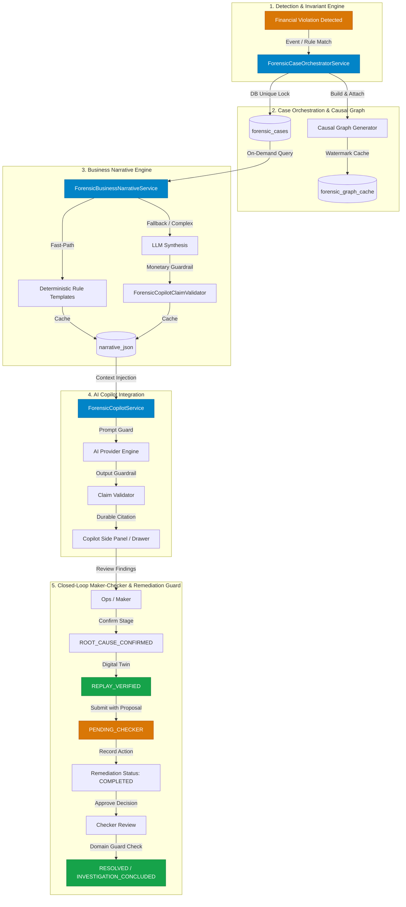
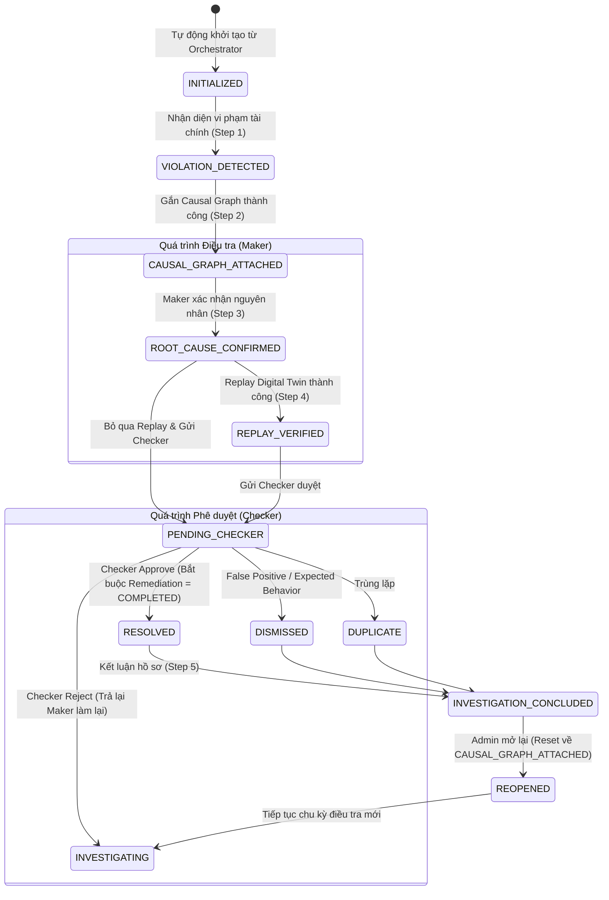

# BRD: AI Financial Forensics & Verification Engine

## Banking Intelligence Platform — Kế hoạch triển khai bám theo repository `bank-system`

| Thuộc tính | Giá trị |
|---|---|
| Phiên bản | 1.1 |
| Trạng thái | Ready for architecture review và phân rã implementation task |
| Ngày lập | 2026-08-11 |
| Phạm vi release | M0-M7, triển khai modular-first và chỉ tách service khi đạt extraction gate |
| Repo mục tiêu | `bank-system` |
| Stack hiện hữu | Java 21, Spring Boot 3.3, Angular 19, PostgreSQL 16, Kafka, Redis, Zipkin, Prometheus, Grafana, Docker Compose, GitHub Actions, Jenkins |
| Đối tượng sử dụng | Product Owner, BA, Architect, Backend/Frontend/QA/DevOps, code agent |

---

## 1. Mục tiêu tài liệu

Tài liệu này chuyển mô tả ý tưởng “AI Financial Forensics & Verification Engine” thành yêu cầu có thể phát triển trực tiếp trên repository hiện tại. Mỗi yêu cầu có mã định danh, owner kỹ thuật, dependency, đầu ra, tiêu chí nghiệm thu và thứ tự triển khai.

Tài liệu là nguồn tham chiếu cho:

- Phân rã Epic/Story/Task và tạo issue.
- Thiết kế schema, API, event contract và UI.
- Lập test plan, rollout plan và CI quality gate.
- Giao việc tuần tự cho CLI code agent.

Nếu code và BRD khác nhau, thay đổi phải đi qua ADR hoặc cập nhật BRD trước khi merge.

---

## 2. Executive Summary

### 2.1 Vấn đề kinh doanh

Một giao dịch chuyển tiền hiện đi qua `api-gateway`, `transaction-service`, `account-service`, Kafka và `notification-service`. Khi một bước lỗi, đội vận hành phải ghép dữ liệu từ transfer order, saga log, ledger entry, outbox, trace và log. Hệ thống đã có saga, idempotency, outbox, tracing và EOD reconciliation, nhưng chưa có một nguồn bằng chứng tài chính double-entry, causal graph, time travel hoặc replay sandbox thống nhất.

Hệ quả:

- Khó xác định tiền đã rời tài khoản nguồn, tới tài khoản đích, vào tài khoản phí hay đã được bù trừ.
- Không có invariant engine chạy đồng bộ tại điểm commit.
- Trace hiện hữu chưa được chuẩn hóa quanh `transaction_id` và chưa tạo graph điều tra.
- Không thể dựng lại trạng thái tài chính tại thời điểm T một cách có kiểm chứng.
- Incident đã xử lý chưa tự động trở thành regression scenario.
- Nếu thêm AI trực tiếp lên raw log, rủi ro hallucination và lộ PII cao.

### 2.2 Mục tiêu sản phẩm

Xây dựng 6 lớp theo đúng thứ tự phụ thuộc:

1. Chuẩn hóa ledger và event foundation.
2. Phát hiện vi phạm tài chính bằng logic tất định.
3. Dựng causal graph từ trace và domain event.
4. Time travel, sanitize, fork và replay trong sandbox.
5. AI Copilot chỉ diễn giải evidence có cấu trúc.
6. Biến incident đã xác nhận thành regression test có PR gate.

### 2.3 Kết quả kinh doanh kỳ vọng

- Rút ngắn MTTR điều tra giao dịch lỗi.
- Phát hiện sai lệch trước khi khách hàng khiếu nại.
- Có evidence package có cấu trúc phục vụ audit.
- Chứng minh fix bằng replay trước khi tác động dữ liệu thật.
- Ngăn lỗi cũ tái phát qua CI.

### 2.4 Nguyên tắc bất biến

- AI không quyết định đúng/sai tài chính.
- Đường ghi tiền không phụ thuộc model hoặc AI provider.
- AI không truy cập production DB, raw log hoặc trace backend trực tiếp.
- Số liệu AI nêu phải tồn tại trong tool evidence và vượt qua response validator.
- Không có auto-merge từ nhánh `ai/*`.
- Dataset vào sandbox hoặc Git phải qua sanitizer và PII scanner.
- Journal/posting đã `POSTED` là bất biến; sửa sai bằng reversal, không `UPDATE`/`DELETE`.
- Amount dùng `NUMERIC(19,2)`/`BigDecimal`, tuyệt đối không dùng floating point.
- Tất cả timestamp lưu UTC; business date sử dụng zone cấu hình hiện có.

---

## 3. Hiện trạng repository và quyết định tích hợp

### 3.1 Thành phần tái sử dụng

| Năng lực | Hiện trạng | Hướng sử dụng |
|---|---|---|
| Transfer orchestration | `transaction-service/.../TransferSagaOrchestrator.java` | Refactor state machine, không xây lại service transfer |
| Idempotency | Unique `transfer_orders.idempotency_key`; ledger unique theo account/reference/type | Nâng thành idempotency lifecycle có owner, fingerprint, state và expiry |
| Ledger | `account-service` có `accounts.balance` và `ledger_entries` | Migrate sang `journals` + `postings`; giữ read compatibility trong giai đoạn chuyển đổi |
| Outbox | `transaction-service.outbox_events`, poller có retry/dead-letter | Chuẩn hóa envelope và thêm outbox cho financial event tại `account-service` |
| Reconciliation | `ReconciliationService` + pure `ReconciliationMatcher` | Tái sử dụng rule và tiến hóa thành batch verification |
| Correlation | Gateway/common-lib có `X-Correlation-Id`, MDC, trace/span ID | Bổ sung `X-Transaction-Id`; phân biệt request correlation và business transaction |
| Tracing | Micrometer/Zipkin | M1-M2 giữ tương thích; M3 đưa qua OTel Collector và Tempo |
| Monitoring | Prometheus + Grafana | Thêm metrics/dashboard/SLO của 5 engine |
| CI | GitHub Actions + Jenkins | GitHub Actions là PR gate; Jenkins tiếp tục build/package/deploy |
| Admin UI | Angular admin features và layout hiện có | Thêm feature lazy-loaded `admin/forensics` và quyền riêng |

### 3.2 Gap bắt buộc xử lý

| Gap ID | Khoảng trống | Ảnh hưởng | Xử lý tại |
|---|---|---|---|
| GAP-01 | `ledger_entries` là single-entry, không có journal | Không thể enforce debit = credit | M1 |
| GAP-02 | `accounts.balance` chưa tách booked/available/hold | Không kiểm tra được hold invariant | M1 |
| GAP-03 | Saga chạy tuần tự trong request và trạng thái chưa phản ánh đầy đủ publish/confirm | Crash recovery chưa đủ chặt | M1 |
| GAP-04 | Outbox được enqueue qua method riêng, cần chứng minh cùng local transaction với business state | Nguy cơ dual-write ở boundary | M1 |
| GAP-05 | Correlation ID không đồng nghĩa transaction ID | Query forensic không ổn định | M1 |
| GAP-06 | Zipkin dev backend không phải event store điều tra dài hạn | Không đủ retention/query theo business ID | M3 |
| GAP-07 | Không có append-only financial event/snapshot | Không time travel đáng tin cậy | M1/M4 |
| GAP-08 | Jenkins mặc định `SKIP_TESTS=true` | Không phù hợp money-flow gate | M6 |
| GAP-09 | Chưa có AI boundary/tool validator | Hallucination và data leakage | M5 |

### 3.3 Quyết định kiến trúc

1. `account-service` tiếp tục là system of record của account và ledger; không tạo `ledger-service` trùng chức năng trong release này.
2. Giai đoạn đầu đặt invariant tài chính bắt buộc trong `account-service/domain/ledger` và các use case điều tra trong `transaction-service/application/forensics`. Chỉ tạo Maven module thuần Java `financial-verification-core` khi cùng một rule thực sự cần dùng ở từ hai bounded context trở lên; tuyệt đối không đưa business rule vào `common-lib`.
3. Mỗi business transfer tạo một journal cân bằng. Principal và fee là các posting của cùng journal; compensation/reversal là journal mới trỏ tới original journal.
4. Giai đoạn migration dùng dual-read, không dùng dual-write vô thời hạn. Dữ liệu cũ được backfill, đối soát, sau đó cut over.
5. `transaction_id` là business ID ổn định; `correlation_id` là ID của một request; `trace_id` là ID observability. Cả ba được giữ riêng.
6. Release đầu dựng causal graph từ dữ liệu bền vững sẵn có: transfer order, saga step, ledger, outbox, reconciliation và audit. OTel Collector + Tempo là adapter bổ sung sau; trace không bao giờ là financial source of truth.
7. API forensic nằm trong `transaction-service` dưới `/api/v1/admin/forensics/**`; API ledger/evidence thuộc account vẫn là internal API có `@RequireInternalApiKey`. Chỉ tách thành service riêng khi đạt extraction gate ở mục 6.3.
8. Mọi endpoint admin dùng permission dạng lowercase có namespace, phù hợp `SecurityHeaders` hiện tại, ví dụ `forensics:view`; không tạo permission uppercase kiểu role.
9. Controller chỉ nhận DTO, tạo Query/Command và gọi Application Service. Repository, JDBC, AI SDK, object storage SDK và Feign client không được inject vào Controller.
10. Mọi cấu hình provider/endpoint/timeout/secret chỉ xuất hiện dưới dạng placeholder; giá trị local nằm trong `application-local.yml` hoặc `infra/.env`, không thêm dữ liệu thật hay default bí mật vào `application.yml`.

### 3.4 Sơ đồ Kiến trúc Tổng thể & Luồng Xử lý Khép kín (Target Architecture & Closed-Loop Flow)

#### A. Kiến trúc Điều phối Tổng thể (End-to-End Orchestrated Forensics Pipeline)



#### B. Sơ đồ Máy trạng thái & Tiến trình Điều tra 5 Bước (Investigation Stage Machine)



---

## 4. Phạm vi

### 4.1 In-scope

- Chuyển tiền nội bộ VND, gồm phí và compensation.
- Double-entry journal/posting và account hold.
- Verification real-time, on-demand, window batch.
- Causal graph từ saga, journal, outbox, Kafka delivery và distributed trace.
- Temporal state theo account/transaction tại timestamp.
- Snapshot, sanitizer, sandbox fork và deterministic replay ở mức application.
- Fault timeout/delay/duplicate/message failure theo YAML scenario.
- AI tool-use, evidence citation, numeric/identifier validation và raw fallback.
- Admin forensic workbench.
- Incident-to-regression workflow và CI gate.

### 4.2 Out-of-scope

- Multi-currency FX accounting.
- Cross-region active-active và region-specific compliance.
- Network/clock virtualization cấp thấp.
- Tự động sửa production data.
- AI tự tạo, approve hoặc merge production fix.
- Fine-tuning model.
- Thay thế hệ thống case management/ticketing đầy đủ.

### 4.3 Giả định

- Một account chỉ có một currency; transfer release đầu chỉ cho hai account cùng currency VND.
- PostgreSQL là source of truth; Kafka delivery là at-least-once.
- Môi trường demo/dev chạy Docker Compose.
- Production-like dataset chỉ được xuất qua pipeline sanitize, không copy DB thủ công.

---

## 5. Stakeholder, persona và quyền

| Persona | Nhu cầu | Quyền đề xuất |
|---|---|---|
| Ops Investigator | Tìm giao dịch, xem timeline/evidence, chạy check | `forensics:view`, `forensics:verify:execute` |
| Reconciliation Officer | Xem violation, resolve/annotate, export evidence | `forensics:case:review`, `forensics:evidence:export` |
| QA Engineer | Tạo fork/replay từ scenario sanitized | `forensics:replay:execute` |
| Developer | Xem evidence kỹ thuật, tải scenario sanitized | `forensics:view`, không xem PII |
| Regression Reviewer | Review scenario PR | GitHub team `regression-reviewers` |
| Auditor | Read-only evidence package và audit trail | `forensics:audit:view` |
| Platform Admin | Cấu hình retention/provider/feature flag | `forensics:admin` |

Segregation of duties: người trigger replay có thể xem kết quả nhưng không được tự resolve violation mức `CRITICAL`; resolution cần reviewer khác hoặc quyền elevated có audit reason.

---

## 6. Kiến trúc mục tiêu bám repo

```text
Angular Admin / Ask the Bank
           |
      API Gateway
           |
  +---------------------------+--------------------------+
  |                           |                          |
transaction-service     account-service          notification-service
  | forensics/case/AI      | ledger/journal/hold     | alert/inbox/SSE
  | risk/recon/audit       | posting/evidence API    |
  +-------------+-------------+--------------------------+
                |
         Kafka + PostgreSQL + Redis + MinIO
                |
       optional OTel Collector/Tempo adapter
```

### 6.1 Cấu trúc triển khai release đầu

```text
backend/
├── common-lib/
│   └── security/                   # permission constants/annotations, không chứa rule forensic
├── account-service/
│   └── .../account/
│       ├── api/ledger/             # internal evidence API
│       ├── application/ledger/     # journal/posting/hold use case
│       ├── domain/ledger/          # aggregate + invariant tài chính
│       └── infrastructure/ledger/  # persistence/object-store adapter
├── transaction-service/
│   └── .../transaction/
│       ├── api/forensics/          # admin REST DTO boundary
│       ├── application/forensics/  # investigate/verify/case/export/copilot use case
│       ├── domain/forensics/       # case, evidence, finding, graph, policy
│       └── infrastructure/forensics/
│           ├── account/            # internal account evidence client
│           ├── ai/                 # provider adapter, tool executor, validator
│           ├── objectstorage/      # MinIO evidence/snapshot adapter
│           └── tracing/            # optional Zipkin/Tempo evidence adapter
├── auth-service/                   # permission catalog/role migration
└── notification-service/           # FORENSIC_ALERT event -> ops inbox/SSE

frontend/bank-angular-app/src/app/features/admin/forensics/
├── forensics.routes.ts
├── investigation-list/
├── investigation-detail/
├── evidence-timeline/
├── causal-graph/
├── findings/
├── replay-runs/
└── ask-the-bank/

sandbox/scenarios/
scripts/sanitize/
docs/adr/
```

Release đầu không thêm route gateway mới theo service vì `/api/v1/admin/**` đã đi vào `transaction-service`. Menu admin thêm lazy route `forensics`; mọi component giữ ba file `.ts/.html/.scss`, toàn bộ text qua `ngx-translate`, dữ liệu danh mục/rule/model lấy từ REST API.

### 6.2 Ranh giới trách nhiệm

| Thành phần | Sở hữu | Không được làm |
|---|---|---|
| `account-service` | Journal, posting, hold, booked/available balance, financial event gốc | Không gọi AI; không resolve forensic case |
| `transaction-service` | Transfer/saga/risk/reconciliation, forensic case, finding, evidence index, graph, replay orchestration, AI tool orchestration | Không cập nhật trực tiếp account DB; không coi trace là sổ cái |
| `customer-service` | KYC/customer profile; cung cấp internal projection tối thiểu theo permission | Không trả raw document KYC cho AI/forensics mặc định |
| `notification-service` | Ops alert/inbox/SSE, delivery retry | Không tự suy luận severity hoặc case state |
| `auth-service` | Permission catalog, role assignment, segregation of duties | Không lưu evidence nghiệp vụ |
| `common-lib` | Security annotation/header, API envelope, utility thực sự dùng chung | Không chứa entity/repository/business rule của forensic |

### 6.3 Extraction gate

Chỉ tách `verification-engine` hoặc `ai-copilot-service` thành microservice riêng khi đồng thời có ADR và ít nhất một điều kiện định lượng:

- Cần scale worker độc lập và tải batch làm ảnh hưởng SLO của `transaction-service`.
- Có owner/team, vòng đời release hoặc data-retention độc lập.
- Database forensic vượt giới hạn vận hành đã thống nhất hoặc cần isolation pháp lý.
- AI provider dependency làm tăng attack surface và cần network boundary riêng.
- Contract event/API đã version hóa, có idempotency và không cần distributed transaction.

Nếu tách service, phải bổ sung module Maven, `application-local.yml`, route gateway local, Eureka, Docker profile tùy chọn, Prometheus scrape, internal API key, Kafka consumer group và migration database riêng. Không tách chỉ để đạt hình thức microservice.

---

## 7. Luồng nghiệp vụ chuẩn

### 7.1 Happy path transfer

1. Gateway nhận request, tạo/validate `X-Correlation-Id`, không tin `X-Transaction-Id` từ client.
2. `transaction-service` kiểm tra idempotency key + request fingerprint.
3. Service tạo `transaction_id`, `transfer_order=INITIATED` và idempotency record trong cùng transaction.
4. Saga yêu cầu account service đặt hold cho `amount + fee`.
5. Account service tạo journal draft gồm source debit, destination credit và fee-income credit; core validator xác nhận balance/currency/account.
6. DB deferred constraint trigger xác nhận tổng debit bằng tổng credit trước commit.
7. Journal chuyển `POSTED`, account balances cập nhật, hold release, financial event và outbox được ghi cùng transaction.
8. Transaction service nhận kết quả idempotent, chuyển saga `JOURNAL_COMMITTED`.
9. Outbox publish event, saga ghi `EVENT_PUBLISHED`; consumer ACK/confirmation đưa transfer tới `CREDIT_CONFIRMED`, rồi `COMPLETED`.
10. Verification engine nhận event, chạy rules và lưu evidence/result.

### 7.2 Duplicate request/message

- Cùng idempotency key + cùng fingerprint: trả lại outcome cũ.
- Cùng key + khác fingerprint: HTTP 409 `IDEMPOTENCY_KEY_REUSED`.
- Cùng event ID: consumer ghi nhận duplicate nhưng không tạo thêm journal/posting.
- Cùng transaction ID chỉ được có một primary outcome; reversal phải khai báo `reversal_of_journal_id`.

### 7.3 Failure và recovery

- Trước journal commit: release hold, transfer `FAILED`; không có posting tài chính.
- Sau journal commit nhưng trước publish: outbox worker resume, không tạo journal mới.
- Không xác định được kết quả remote call: query theo command/idempotency key trước khi retry.
- Compensation: tạo reversal journal cân bằng; không sửa posting gốc.
- Saga recovery scheduler claim record bằng lease/version, tiếp tục từ durable state cuối.
- Sau `max_recovery_age`, chuyển `MANUAL_REVIEW_REQUIRED` và phát violation, không tự giả định thất bại.

### 7.4 Investigation flow

1. Ops nhập transaction ID.
2. UI gọi verification + causal graph song song.
3. Timeline đánh dấu rule-based anomaly và liên kết evidence nguồn.
4. Khi cần, Ops chọn timestamp để xem temporal state.
5. QA/Ops có quyền tạo sanitized fork, chạy scenario và so sánh before/after.
6. AI chỉ được gọi sau khi structured evidence đã sẵn sàng.

---

## 8. Yêu cầu chức năng chi tiết

### 8.1 Lớp 0 — Data Foundation

#### Epic L0-E1: Double-entry ledger

| ID | Yêu cầu | Ưu tiên | Nghiệm thu |
|---|---|---|---|
| L0-FR-001 | Tạo `journals` và `postings` trong account DB | Must | Một journal có ít nhất 2 posting; amount > 0; currency hợp lệ |
| L0-FR-002 | Enforce cân bằng bằng deferred constraint trigger ở DB | Must | Transaction chứa journal lệch bị reject tại commit |
| L0-FR-003 | Journal `POSTED` không được sửa/xóa | Must | Trigger chặn update/delete; reversal tạo journal mới |
| L0-FR-004 | Mỗi command tài chính có unique `(transaction_id, journal_type, sequence_no)` | Must | Retry không tạo outcome thứ hai |
| L0-FR-005 | Backfill ledger cũ thành journal có balancing/migration account rõ ràng | Must | 100% record được map hoặc đưa exception report; tổng trước/sau bằng nhau |
| L0-FR-006 | Giữ statement/read API tương thích trong cutover | Must | Existing frontend/test không gãy trong migration window |

#### Epic L0-E2: Balance và hold

| ID | Yêu cầu | Ưu tiên | Nghiệm thu |
|---|---|---|---|
| L0-FR-010 | `accounts` có `booked_balance`, `available_balance`, `version` | Must | Optimistic/pessimistic concurrency test không lost update |
| L0-FR-011 | Tạo `account_holds` với trạng thái ACTIVE/CAPTURED/RELEASED/EXPIRED | Must | Available = booked - tổng active hold |
| L0-FR-012 | Hold/capture/release idempotent theo command ID | Must | Retry 100 lần chỉ có một hiệu ứng |
| L0-FR-013 | Scheduler xử lý hold hết hạn có lease | Should | Hai instance không release hai lần |

#### Epic L0-E3: Saga, idempotency và outbox

| ID | Yêu cầu | Ưu tiên | Nghiệm thu |
|---|---|---|---|
| L0-FR-020 | Saga state: `INITIATED`, `DEBIT_HELD`, `JOURNAL_COMMITTED`, `EVENT_PUBLISHED`, `CREDIT_CONFIRMED`, `COMPLETED`, `FAILED`, `COMPENSATING`, `COMPENSATED`, `MANUAL_REVIEW_REQUIRED` | Must | Transition ngoài bảng cho phép bị reject |
| L0-FR-021 | Mỗi transition ghi `saga_step_logs` và version atomically | Must | Crash sau transition không mất state/log |
| L0-FR-022 | Idempotency record được tạo trước side effect, trạng thái PROCESSING/COMPLETED/FAILED/EXPIRED | Must | Concurrent same-key request có một owner |
| L0-FR-023 | Outbox ghi cùng local transaction với journal/order tương ứng | Must | Kill tại mọi failpoint không tạo business state thiếu event |
| L0-FR-024 | Event envelope chuẩn có `event_id`, `event_type`, `schema_version`, `transaction_id`, `correlation_id`, `trace_id`, `occurred_at`, `producer`, `data` | Must | Contract test producer/consumer pass |
| L0-FR-025 | `X-Transaction-Id` propagate qua Feign, Kafka header và OTel baggage | Must | Một test transfer thấy cùng ID ở mọi service |

#### Epic L0-E4: Financial event store

| ID | Yêu cầu | Ưu tiên | Nghiệm thu |
|---|---|---|---|
| L0-FR-030 | Ghi append-only `financial_events` theo aggregate + sequence | Must | Sequence liên tục, unique aggregate/version |
| L0-FR-031 | Event payload không chứa PII không cần thiết | Must | PII scanner pass |
| L0-FR-032 | Có schema version/upcaster contract | Should | Replay được event phiên bản N-1 và N |

### 8.2 Lớp 1 — Verification Engine

#### Rule catalog v1

| Rule ID | Tên | Scope | Severity mặc định | Evidence tối thiểu |
|---|---|---|---|---|
| INV-JOURNAL-001 | Journal balanced | Journal | CRITICAL | journal ID, debit total, credit total, posting IDs |
| INV-BALANCE-001 | Available balance formula | Account | CRITICAL | booked, active holds, available |
| INV-BALANCE-002 | Posting-derived balance | Account | CRITICAL | opening, posting sum, stored booked |
| INV-OUTCOME-001 | One business transaction, one outcome | Transaction | CRITICAL | primary/reversal journal IDs |
| INV-IDEMP-001 | Duplicate event has one financial effect | Event/transaction | HIGH | event ID, command ID, journal IDs |
| INV-SAGA-001 | Saga state agrees with journal state | Transaction | HIGH | saga state, journal state, timestamps |
| INV-OUTBOX-001 | Committed journal has publishable event | Journal | HIGH | journal ID, outbox/event IDs |
| INV-CURRENCY-001 | Posting currencies match journal/account | Journal | CRITICAL | currency fields |

| ID | Yêu cầu | Ưu tiên | Nghiệm thu |
|---|---|---|---|
| L1-FR-001 | Rule là pure function trả `PASS/FAIL/INCONCLUSIVE` + evidence | Must | Unit test không mock network/DB |
| L1-FR-002 | Account service chạy synchronous critical rules trước commit | Must | Inject imbalance bị chặn dưới 1 giây |
| L1-FR-003 | Engine chạy on-demand theo transaction ID | Must | API trả result từng rule và evidence |
| L1-FR-004 | Batch job mặc định 5 phút, window có watermark/overlap | Must | Không bỏ record ở boundary; rerun idempotent |
| L1-FR-005 | Lưu violation và lifecycle OPEN/ACKNOWLEDGED/RESOLVED/FALSE_POSITIVE | Must | Mọi status change có actor/reason/audit |
| L1-FR-006 | Không auto-resolve CRITICAL chỉ vì lần check sau pass | Must | Cần reviewer và evidence resolution |
| L1-FR-007 | Cho export evidence package JSON đã redact | Should | Hash/manifest xác nhận package không bị sửa |

### 8.3 Lớp 2 — Causal Graph Engine

#### Node/edge contract

- Node types: `HTTP_SPAN`, `KAFKA_PRODUCE`, `KAFKA_CONSUME`, `SAGA_TRANSITION`, `JOURNAL`, `POSTING`, `OUTBOX_EVENT`, `VERIFICATION_RESULT`.
- Edge types: `PARENT_OF`, `CAUSED_BY`, `PUBLISHED_AS`, `CONSUMED_AS`, `TRANSITIONED_TO`, `POSTED_AS`, `REVERSES`, `VERIFIED_BY`.
- Mỗi node có `id`, `type`, `service`, `timestamp`, `duration_ms`, `status`, `transaction_id`, `evidence_ref`, `attributes` đã allowlist.

| ID | Yêu cầu | Ưu tiên | Nghiệm thu |
|---|---|---|---|
| L2-FR-001 | Instrument request/Feign/Kafka/worker bằng OTel | Must | Trace xuyên tối thiểu 7 hop không đứt context |
| L2-FR-002 | Collector loại secret/PII và enrich service/env/version | Must | Forbidden attributes không vào Tempo |
| L2-FR-003 | Graph builder merge trace với domain evidence theo stable IDs | Must | Không dùng timestamp đơn độc để suy ra quan hệ |
| L2-FR-004 | Anomaly rule cho timeout, retry, duplicate, idempotency reject, latency > p95, impossible transition | Must | Mỗi anomaly nêu rule ID và baseline |
| L2-FR-005 | Root-cause candidate là kết quả rule-based, không phải AI | Must | Test fixture trả đúng first failing causal node |
| L2-FR-006 | Failure signature canonical hóa graph và nhóm transaction | Should | Cùng fixture lỗi có cùng signature, bỏ qua random IDs |
| L2-FR-007 | API trả partial graph với `completeness` khi nguồn thiếu | Must | Không biến thiếu trace thành kết luận chắc chắn |

### 8.4 Lớp 3 — Temporal Engine và Digital Twin

| ID | Yêu cầu | Ưu tiên | Nghiệm thu |
|---|---|---|---|
| L3-FR-001 | Replay financial events tới timestamp T | Must | State bằng fixture historical expected |
| L3-FR-002 | Snapshot mỗi giờ hoặc theo event threshold | Must | Snapshot có last sequence, schema version, checksum |
| L3-FR-003 | Query dùng snapshot gần nhất <= T rồi replay delta | Must | Kết quả giống full replay |
| L3-FR-004 | Sanitizer dùng mapping deterministic có salt ngoài Git | Must | Quan hệ ID được giữ, không thể suy ngược nếu thiếu salt |
| L3-FR-005 | Giữ amount/timing/failure shape cần tái hiện nhưng loại PII | Must | Scanner không phát hiện email, phone, national ID, PAN, name |
| L3-FR-006 | Fork tạo namespace/network/volume riêng, TTL và quota | Must | Sandbox không route tới production hostname/credential |
| L3-FR-007 | Fault rules: timeout, delay, duplicate, fail-before/after-commit, Kafka unavailable | Must | Scenario cùng seed cho cùng outcome |
| L3-FR-008 | Replay trả verification diff before/after | Must | Result có run ID, seed, image SHA, commit SHA, evidence |
| L3-FR-009 | Run có trạng thái QUEUED/PROVISIONING/RUNNING/PASSED/FAILED/ERROR/EXPIRED | Must | Poll API nhất quán, retry không tạo run trùng |

### 8.5 Lớp 4 — AI Copilot

| ID | Yêu cầu | Ưu tiên | Nghiệm thu |
|---|---|---|---|
| L4-FR-001 | Tool registry chỉ expose allowlisted structured APIs | Must | Model không thể gọi URL/SQL/shell tùy ý |
| L4-FR-002 | Tool: `check_invariant`, `get_causal_graph`, `get_temporal_state`, `trigger_replay`, `get_replay_result` | Must | JSON Schema validation pass ở input/output |
| L4-FR-003 | System policy buộc kết luận theo evidence và nói “không đủ bằng chứng” | Must | Adversarial eval pass |
| L4-FR-004 | Validator đối chiếu amount, currency, transaction/account/run ID và claim citation | Must | Claim không nguồn bị discard |
| L4-FR-005 | Mỗi câu kết luận quan trọng có `evidence_ref` hiển thị được | Must | Click evidence mở đúng raw panel |
| L4-FR-006 | Provider abstraction OpenAI-compatible; Ollama local mặc định | Must | Đổi provider bằng config, không sửa domain code |
| L4-FR-007 | Timeout/circuit breaker/rate limit/budget | Must | Provider off vẫn dùng raw mode đầy đủ |
| L4-FR-008 | Không lưu prompt chứa PII; audit metadata không lưu chain-of-thought | Must | Log review và scanner pass |
| L4-FR-009 | AI không có tool sửa ledger, resolve violation, merge PR | Must | Security test không tìm thấy write capability đó |

### 8.6 Lớp 5 — CI Feedback Loop

| ID | Yêu cầu | Ưu tiên | Nghiệm thu |
|---|---|---|---|
| L5-FR-001 | Scenario YAML có JSON Schema và version | Must | Invalid scenario fail lint |
| L5-FR-002 | Incident chỉ sinh scenario sau human confirmation | Must | Có confirmed_by/confirmed_at/source evidence |
| L5-FR-003 | Automation tạo `ai/regression-<incident-id>` và draft PR | Must | Không có quyền merge |
| L5-FR-004 | Money-flow test nằm tại `tests/regression/money-flow/` | Must | Naming và manifest lint pass |
| L5-FR-005 | Path gate chạy khi đổi account/transaction/core/engine/schema/scenario | Must | Revert fixture bug làm CI đỏ |
| L5-FR-006 | Branch protection yêu cầu status check + approval `regression-reviewers` | Must | API/config audit xác nhận không bypass |
| L5-FR-007 | Dashboard ghi scenario count, added date, detected regression count | Should | CI publish metrics/artifact |

---

## 9. Mô hình dữ liệu logical

### 9.1 Account database

#### `journals`

| Column | Kiểu | Ràng buộc/Ghi chú |
|---|---|---|
| `id` | UUID | PK |
| `transaction_id` | UUID | NOT NULL, indexed |
| `journal_type` | VARCHAR(30) | TRANSFER, REVERSAL, FEE, ADJUSTMENT |
| `sequence_no` | INT | default 1 |
| `currency` | CHAR(3) | release đầu VND |
| `status` | VARCHAR(20) | DRAFT, POSTED, REVERSED |
| `reversal_of_journal_id` | UUID | nullable FK journal |
| `idempotency_key` | VARCHAR(100) | command-level unique scope |
| `effective_at` | TIMESTAMPTZ | business time |
| `created_at` | TIMESTAMPTZ | system time |
| `posted_at` | TIMESTAMPTZ | nullable |
| `version` | BIGINT | optimistic lock |

Unique: `(transaction_id, journal_type, sequence_no)` và partial unique `reversal_of_journal_id` cho reversal active.

#### `postings`

| Column | Kiểu | Ràng buộc/Ghi chú |
|---|---|---|
| `id` | UUID | PK |
| `journal_id` | UUID | NOT NULL FK |
| `account_id` | UUID | NOT NULL FK |
| `side` | VARCHAR(6) | DEBIT/CREDIT |
| `amount` | NUMERIC(19,2) | > 0 |
| `currency` | CHAR(3) | khớp journal/account |
| `posting_role` | VARCHAR(30) | SOURCE, DESTINATION, FEE_INCOME, REVERSAL |
| `created_at` | TIMESTAMPTZ | immutable |

DB sử dụng deferred constraint trigger ở `journals/postings` vì CHECK constraint thông thường không kiểm tra tổng nhiều row. Trigger kiểm tra khi transaction commit, không chỉ tại lần insert posting đầu tiên.

#### `account_holds`

`id`, `account_id`, `transaction_id`, `command_id`, `amount`, `currency`, `status`, `expires_at`, `captured_journal_id`, `created_at`, `updated_at`, `version`.

#### `financial_events`

`event_id`, `aggregate_type`, `aggregate_id`, `sequence_no`, `event_type`, `schema_version`, `transaction_id`, `occurred_at`, `payload_json`, `payload_sha256`.

### 9.2 Transaction database

#### Thay đổi `transfer_orders`

- Thêm `transaction_id` nếu không dùng trực tiếp `id`; khuyến nghị dùng `id` làm transaction ID để tương thích.
- Mở rộng state và thêm `state_version`, `last_recovery_at`, `recovery_attempts`, `journal_id`, `completed_at`.
- Không dùng các entry ref riêng làm source of truth sau cutover; giữ tạm để compatibility/audit.

#### `idempotency_keys`

`id`, `scope`, `idempotency_key`, `request_fingerprint`, `owner_transaction_id`, `state`, `response_code`, `response_body_hash`, `locked_until`, `expires_at`, `created_at`, `completed_at`.

Unique `(scope, idempotency_key)`. TTL không được xóa key trước thời hạn retry/business dispute đã thống nhất; job archive trước delete.

### 9.3 Transaction database — forensic/verification schema

#### `verification_runs`

`id`, `mode`, `scope_type`, `scope_id`, `window_start`, `window_end`, `status`, `rule_set_version`, `started_at`, `finished_at`, `summary_json`.

#### `verification_results`

`id`, `run_id`, `rule_id`, `subject_type`, `subject_id`, `outcome`, `severity`, `evidence_json`, `evidence_hash`, `evaluated_at`.

#### `invariant_violations`

`id`, `dedupe_key`, `transaction_id`, `rule_id`, `severity`, `status`, `first_detected_at`, `last_detected_at`, `occurrence_count`, `evidence_json`, `resolved_at`, `resolved_by`, `resolution_reason`.

### 9.4 Transaction database và object storage — graph/temporal/replay

- `graph_cache`: transaction ID, graph version, completeness, source watermark, graph JSON, expiry.
- `temporal_snapshots`: aggregate, at, last sequence, schema version, checksum, storage URI.
- `twin_runs`: scenario ID, seed, source snapshot, commit/image SHA, status, timestamps, result/evidence URI, expiry.
- Không lưu production PII trong các bảng này.

---

## 10. API contract v1

Tất cả API dùng envelope `ApiResponse` hiện hữu, UTC ISO-8601, pagination hiện hữu, internal errors không trả stack trace. External admin route đi qua gateway `/api/v1/admin/forensics/**`; service-to-service dùng `/internal/**` + internal auth hiện hữu.

### 10.1 Verification

| Method | Endpoint | Quyền | Mô tả |
|---|---|---|---|
| POST | `/api/v1/admin/forensics/verification/check/{transactionId}` | `forensics:verify:execute` | Chạy on-demand, hỗ trợ idempotency key |
| GET | `/api/v1/admin/forensics/verification/runs/{runId}` | `forensics:view` | Kết quả run |
| GET | `/api/v1/admin/forensics/violations` | `forensics:view` | Filter since/status/severity/rule/transaction |
| GET | `/api/v1/admin/forensics/violations/{id}` | `forensics:view` | Detail + evidence |
| POST | `/api/v1/admin/forensics/violations/{id}/acknowledge` | `forensics:case:review` | Ghi nhận điều tra |
| POST | `/api/v1/admin/forensics/violations/{id}/resolve` | `forensics:case:review` | Resolve với reason/evidence |

Ví dụ kết quả rule:

```json
{
  "ruleId": "INV-JOURNAL-001",
  "outcome": "FAIL",
  "severity": "CRITICAL",
  "subject": {"type": "JOURNAL", "id": "..."},
  "evidence": {
    "debitTotal": "100000.00",
    "creditTotal": "99000.00",
    "currency": "VND",
    "postingIds": ["..."]
  },
  "evaluatedAt": "2026-08-11T07:02:10Z"
}
```

### 10.2 Causal graph

| Method | Endpoint | Quyền | Mô tả |
|---|---|---|---|
| GET | `/api/v1/admin/forensics/causal-graph/{transactionId}` | `forensics:view` | Graph JSON |
| GET | `/api/v1/admin/forensics/failure-signatures` | `forensics:view` | Nhóm lỗi |
| GET | `/api/v1/admin/forensics/failure-signatures/{signature}` | `forensics:view` | Các transaction tương đồng |

Response bắt buộc có `completeness: COMPLETE|PARTIAL`, `missingSources`, `nodes`, `edges`, `anomalies`, `rootCauseCandidates`. Không trả field raw log.

### 10.3 Temporal và twin

| Method | Endpoint | Quyền | Mô tả |
|---|---|---|---|
| GET | `/api/v1/admin/forensics/temporal/accounts/{accountId}?at=...` | `forensics:view` | Account state tại T |
| GET | `/api/v1/admin/forensics/temporal/transactions/{transactionId}?at=...` | `forensics:view` | Transaction state tại T |
| POST | `/api/v1/admin/forensics/twin/forks` | `forensics:replay:execute` | Tạo fork từ sanitized snapshot |
| POST | `/api/v1/admin/forensics/twin/replays` | `forensics:replay:execute` | Tạo replay run |
| GET | `/api/v1/admin/forensics/twin/runs/{runId}` | `forensics:replay:execute` | Poll result |
| DELETE | `/api/v1/admin/forensics/twin/forks/{forkId}` | `forensics:replay:execute` | Hủy sandbox; audit bắt buộc |

`POST /twin/replays` cần `Idempotency-Key`; body gồm `forkId`, `scenarioId`, `seed`, `targetCommitSha` và không nhận tùy ý production connection string.

### 10.4 AI Copilot

| Method | Endpoint | Quyền | Mô tả |
|---|---|---|---|
| POST | `/api/v1/admin/forensics/copilot/sessions` | `forensics:copilot:use` | Tạo session gắn transaction/case |
| POST | `/api/v1/admin/forensics/copilot/sessions/{id}/messages` | `forensics:copilot:use` | Hỏi và nhận answer + citations |
| GET | `/api/v1/admin/forensics/copilot/providers/health` | `forensics:admin` | Provider health, không lộ secret |

Response gồm `answer`, `status=ANSWERED|INSUFFICIENT_EVIDENCE|RAW_FALLBACK`, `toolCalls`, `citations`, `validation`. UI luôn render evidence panel cạnh câu trả lời.

### 10.5 Error catalog tối thiểu

`TRANSACTION_NOT_FOUND`, `EVIDENCE_INCOMPLETE`, `INVALID_TIMESTAMP`, `TEMPORAL_EVENT_GAP`, `SNAPSHOT_CHECKSUM_INVALID`, `FORK_QUOTA_EXCEEDED`, `SCENARIO_INVALID`, `REPLAY_ALREADY_RUNNING`, `AI_PROVIDER_UNAVAILABLE`, `AI_RESPONSE_REJECTED`, `IDEMPOTENCY_KEY_REUSED`, `FORBIDDEN_FORENSICS_ACCESS`.

---

## 11. Event contract

```json
{
  "eventId": "uuid",
  "eventType": "ledger.journal.posted.v1",
  "schemaVersion": 1,
  "transactionId": "uuid",
  "correlationId": "uuid",
  "traceId": "hex",
  "producer": "account-service",
  "occurredAt": "2026-08-11T07:02:10Z",
  "data": {
    "journalId": "uuid",
    "currency": "VND",
    "postingCount": 3,
    "debitTotal": "101000.00",
    "creditTotal": "101000.00"
  }
}
```

Quy tắc:

- Decimal serialize dạng string.
- Consumer dedupe theo `eventId`.
- Không đổi nghĩa field của version cũ; breaking change tạo version mới.
- Schema được lint/contract-test trong CI.
- Topic đề xuất: `bank.financial-events.v1`, key = `transactionId`; notification topics hiện hữu giữ nguyên trong migration.

---

## 12. Scenario YAML chuẩn

```yaml
schemaVersion: 1
scenarioId: INC-2026-0001
title: duplicate-event-after-journal-commit
source:
  incidentId: INC-2026-0001
  confirmedBy: regression-reviewer
dataset:
  fixture: fixtures/INC-2026-0001.json
  sanitized: true
  checksum: sha256:...
seed: 982341
input:
  fromAccount: acct_source
  toAccount: acct_dest
  amount: "100000.00"
  currency: VND
faults:
  - at: kafka.publish.ack
    type: timeout_after_success
    occurrences: 1
expectedBefore:
  violations: [INV-IDEMP-001]
expectedAfter:
  violations: []
  journalCount: 1
```

Scenario không chứa tên, email, số điện thoại, national ID, PAN, account number thật, access token, secret hoặc raw log.

---

## 13. UI/UX — Admin Forensic Workbench

### 13.1 Navigation

Thêm mục `Financial Forensics` trong admin navigation, lazy route và route guard theo permission. Toàn bộ text thêm vào `public/i18n/vi.json` và `en.json`, không hardcode.

### 13.2 Screens

| Màn hình | Thành phần chính | Trạng thái bắt buộc |
|---|---|---|
| Investigation Search | transaction ID, time range, rule/severity | empty/loading/not-found/partial/error |
| Investigation Detail | summary, saga timeline, causal graph, journal/postings, violations | graph partial và evidence unavailable |
| Violation Queue | filter, severity, owner, SLA, acknowledge/resolve | permission denied/concurrent update |
| Temporal State | timestamp picker, state diff, event cursor | gap/checksum error |
| Twin Runs | scenario, seed, commit SHA, progress, before-after diff | queued/running/passed/failed/error/expired |
| Ask the Bank | chat, tool activity, citations, raw evidence panel | AI off/rejected/timeout/insufficient evidence |

### 13.3 Quy tắc hiển thị

- Account ID/account number mask theo pipe hiện hữu; chỉ unmask theo quyền và audit.
- Amount luôn có currency; không tô màu đơn thuần để phân biệt debit/credit.
- AI text không được che khuất status tất định.
- `INCONCLUSIVE` và `PARTIAL` phải hiển thị rõ, không dùng màu xanh.
- Graph cần table/list fallback cho accessibility và dataset lớn.

---

## 14. Non-functional requirements

### 14.1 Hiệu năng và SLO

| ID | Chỉ tiêu |
|---|---|
| NFR-PERF-01 | Synchronous verification p95 <= 100 ms, không tính DB commit; toàn bộ phát hiện critical < 1 giây |
| NFR-PERF-02 | On-demand verification p95 <= 1 giây cho một transfer |
| NFR-PERF-03 | Causal graph p95 < 2 giây với 7+ service và <= 500 node |
| NFR-PERF-04 | Temporal query p95 < 3 giây từ snapshot gần nhất |
| NFR-PERF-05 | UI investigation initial result < 3 giây; phần chậm load progressive |
| NFR-PERF-06 | AI không nằm trong SLO core; timeout mặc định 15 giây rồi raw fallback |

### 14.2 Reliability

- RPO financial data = 0 cho committed local transaction.
- Engine restart không làm mất watermark, run hoặc violation.
- Batch có overlap + dedupe để tránh event boundary loss.
- Replay ghi image/commit/schema/seed để tái lập.
- Circuit breaker AI không ảnh hưởng core APIs.

### 14.3 Security và privacy

- RBAC + gateway/internal authentication hiện hữu.
- Encrypt in transit; secret chỉ từ env/secret store, không vào scenario/trace.
- Tool output cho AI qua field allowlist và redaction.
- PII scanner chạy trước sandbox import và trước commit fixture.
- Audit mọi query account/transaction, evidence export, fork, replay, AI session và violation resolution.
- Retention cấu hình theo môi trường; xóa cache/sandbox theo TTL, evidence audit theo policy ngân hàng.
- Threat-model riêng cho prompt injection trong evidence text; model không được biến content thành instruction.

### 14.4 Observability

Metrics tối thiểu:

- `verification_runs_total{mode,outcome}`
- `invariant_violations_total{rule,severity}`
- `verification_duration_seconds`
- `causal_graph_duration_seconds`, `causal_graph_partial_total`
- `temporal_replay_events_total`, `snapshot_checksum_failures_total`
- `twin_runs_total{status}`, `twin_run_duration_seconds`
- `copilot_calls_total{provider,status}`, `copilot_response_rejected_total{reason}`
- `regression_scenarios_total`, `regressions_blocked_total`

Log dùng structured JSON, có transaction/correlation/trace ID nhưng không có raw payload PII.

---

## 15. Migration và rollout

### Phase A — Expand

1. Tạo schema journal/posting/hold/event mới bằng Flyway, chưa đổi luồng cũ.
2. Thêm core library, event envelope và propagation IDs.
3. Backfill ledger cũ bằng job restartable, lưu checkpoint và exception report.
4. Chạy shadow verification, chỉ metric/alert, chưa block.

### Phase B — Validate

1. Đối chiếu balance/statement/order giữa model cũ và mới.
2. Chạy load/concurrency/kill-point test.
3. Chứng minh zero unexplained delta.
4. Chốt cutover checklist và backup/restore rehearsal.

### Phase C — Cut over

1. Feature flag `ledger.journal-write-enabled` theo môi trường.
2. Chuyển write path sang journal; read path vẫn compatibility view.
3. Bật fail-fast rule theo thứ tự: currency/idempotency, balance, journal.
4. Theo dõi error/latency/violation; rollback bằng feature flag nếu chưa ghi irreversible new-only contract.

### Phase D — Contract

1. Ngừng legacy write.
2. Sau retention và xác nhận audit, bỏ code legacy; không drop table cùng release cutover.
3. Drop/archive chỉ bằng migration riêng có backup và approval.

Không rollback bằng cách xóa journal/posting đã commit. Nếu money outcome sai, dùng reversal.

---

## 16. Test strategy

### 16.1 Test pyramid

| Loại | Nội dung |
|---|---|
| Unit | Pure invariants, saga transition table, sanitizer transforms, graph canonicalizer, AI claim validator |
| Repository/DB | Deferred balance trigger, immutable posting, idempotency uniqueness, lock/version, snapshot checksum |
| Contract | Feign API, Kafka schema, AI tool JSON Schema |
| Integration | PostgreSQL/Kafka/Tempo qua Testcontainers hoặc compose |
| E2E | Happy path, duplicate, crash/restart, compensation, investigate, fork/replay, AI-off fallback |
| Chaos/failpoint | before/after DB commit, before/after Kafka ACK, remote timeout, worker crash |
| Security | RBAC, IDOR, PII leak, prompt injection, forbidden tool, secret scan |
| Performance | commit overhead, batch throughput, graph p95, snapshot replay |

### 16.2 Test case bắt buộc

| TC ID | Kịch bản | Kỳ vọng |
|---|---|---|
| TC-MONEY-001 | Insert journal debit != credit | DB reject transaction |
| TC-MONEY-002 | 100 concurrent requests cùng idempotency key | Một journal, cùng outcome |
| TC-MONEY-003 | Cùng key khác payload | 409, không side effect |
| TC-MONEY-004 | Kill sau journal commit trước outbox publish | Restart publish lại, một journal |
| TC-MONEY-005 | Duplicate Kafka delivery | Một financial effect |
| TC-MONEY-006 | Credit/finalization failure | Reversal cân bằng hoặc manual review rõ ràng |
| TC-VERIFY-001 | Corrupt fixture posting-derived balance | Violation đúng rule/evidence |
| TC-GRAPH-001 | Trace 7 service với timeout | Root candidate đúng và < 2 giây |
| TC-TEMP-001 | State từ snapshot+delta | Bằng full replay |
| TC-TWIN-001 | Same scenario + seed chạy 3 lần | Cùng deterministic result |
| TC-PII-001 | Fixture chứa phone/email/PAN | Pipeline fail trước import/commit |
| TC-AI-001 | Model nêu amount không có nguồn | Response discard, raw fallback |
| TC-AI-002 | Provider offline | Core UI hoạt động raw-only |
| TC-CI-001 | Revert bug fixture | Required check fail, PR bị chặn |

### 16.3 Exit criteria 24 giờ

Tiêu chí “0 false positive trong 24h” chỉ có giá trị khi:

- Dataset/traffic profile và rule-set version được ghi lại.
- Có tối thiểu số lượng transaction thống nhất trước test.
- `INCONCLUSIVE` không bị tính nhầm PASS.
- Mọi alert được triage và sign-off bởi BA/QA/Finance SME.

---

## 17. Backlog triển khai cho code agent

Mỗi task chỉ bắt đầu khi dependency đã merge. Code agent phải đọc module hiện hữu, thêm migration tăng dần, giữ backward compatibility, chạy test liên quan và không tự merge.

### M0 — Discovery và ADR (bắt buộc trước M1)

| Task | Đầu ra | Dependency |
|---|---|---|
| M0-T01 | ADR ledger ownership: `account-service` là system of record | None |
| M0-T02 | ADR journal accounting convention và fee/reversal | M0-T01 |
| M0-T03 | ADR ID taxonomy và propagation | None |
| M0-T04 | ADR OTel Collector + Tempo retention | None |
| M0-T05 | Baseline existing transfer/reconciliation tests và metrics | None |

### M1 — Lớp 0

| Task | File/module chính | Kết quả kiểm chứng |
|---|---|---|
| M1-T01 | `account-service/domain/ledger` + `transaction-service/application/forensics` | Pure invariant/policy skeleton; ADR quyết định có cần shared core hay không |
| M1-T02 | account Flyway migration | journals/postings/holds/events + indexes/triggers |
| M1-T03 | account domain/application | Journal posting service atomically updates balances |
| M1-T04 | migration/backfill command | Restartable, report delta/exception |
| M1-T05 | transaction Flyway/domain | Durable idempotency + expanded saga states/version |
| M1-T06 | common-lib/gateway/Feign/Kafka | Transaction ID propagation contract test |
| M1-T07 | account + transaction outbox | Business state/event atomicity kill tests |
| M1-T08 | saga recovery scheduler | Crash at each failpoint resumes safely |
| M1-T09 | compatibility read API | Existing Angular statement/transfer tests pass |
| M1-T10 | compose/env/metrics/docs | Local E2E transfer observable |

### M2 — Lớp 1

| Task | File/module chính | Kết quả kiểm chứng |
|---|---|---|
| M2-T01 | core rule catalog | 7 rules + fixtures pass |
| M2-T02 | account commit hook | Critical fail-fast, p95 <= 100 ms |
| M2-T03 | `transaction-service/.../forensics` | Vertical slice verification, DB, security, health; chưa tách service |
| M2-T04 | verification APIs | OpenAPI/contract/integration tests |
| M2-T05 | batch scheduler | Watermark/overlap/dedupe tests |
| M2-T06 | violation lifecycle | RBAC/audit/concurrency tests |
| M2-T07 | Grafana/Prometheus | Alert/dashboard visible |
| M2-T08 | 24h soak test | Signed report 0 false positive |

### M3 — Lớp 2

| Task | File/module chính | Kết quả kiểm chứng |
|---|---|---|
| M3-T01 | infra Collector/Tempo/Grafana | Trace persisted/queryable |
| M3-T02 | common instrumentation | Context xuyên HTTP/Kafka/workers |
| M3-T03 | `transaction-service/infrastructure/forensics/tracing` | Trace/domain sources normalized qua port |
| M3-T04 | graph builder | Stable node/edge contract |
| M3-T05 | anomaly/root rules | 5 known failure fixtures pass |
| M3-T06 | failure signatures/cache | Canonical/dedupe/expiry tests |
| M3-T07 | graph API/performance | p95 < 2 giây |
| M3-T08 | Angular graph/detail UI | Partial/error/accessibility states pass |

### M4 — Lớp 3

| Task | File/module chính | Kết quả kiểm chứng |
|---|---|---|
| M4-T01 | `transaction-service/application/forensics/temporal` | Replay core không phụ thuộc provider |
| M4-T02 | snapshot job/store | Checksum/upcaster/corruption tests |
| M4-T03 | temporal APIs/UI | Snapshot+delta equals full replay |
| M4-T04 | `scripts/sanitize` | Deterministic mapping + PII scan |
| M4-T05 | sandbox compose/network | No production egress/credential |
| M4-T06 | fault middleware + YAML schema | 5 fault types deterministic |
| M4-T07 | `transaction-service/application/forensics/replay` | Fork/replay/status/TTL/quota; extraction review sau hardening |
| M4-T08 | before-after verifier | Known bug matches source evidence |

### M5 — Lớp 4

| Task | File/module chính | Kết quả kiểm chứng |
|---|---|---|
| M5-T01 | AI provider interface/Ollama adapter | Config swap + health |
| M5-T02 | tool registry/schemas | Only allowlisted read tools + controlled replay |
| M5-T03 | system policy/prompt-injection guard | Adversarial tests |
| M5-T04 | claim/evidence validator | Fabricated IDs/numbers rejected |
| M5-T05 | timeout/circuit breaker/raw fallback | AI-off E2E pass |
| M5-T06 | Ask the Bank UI | Citations/raw panel/tool status |
| M5-T07 | 20-question eval suite | 0 unvalidated numeric claim displayed |
| M5-T08 | privacy/security review | No PII/raw log/provider leak |

### M6 — Lớp 5

| Task | File/module chính | Kết quả kiểm chứng |
|---|---|---|
| M6-T01 | scenario JSON Schema/linter | Valid/invalid fixtures |
| M6-T02 | regression runner | YAML -> deterministic test |
| M6-T03 | GitHub Actions path gate | Money paths trigger suite |
| M6-T04 | Jenkins update | Money-flow tests không default skip |
| M6-T05 | incident-to-draft-PR automation | Human-confirmed input only |
| M6-T06 | CODEOWNERS/branch rules doc/check | Reviewer approval enforced |
| M6-T07 | regression value metrics/dashboard | Block count recorded |
| M6-T08 | revert-bug proof | PR red đúng scenario |

### M7 — Demo và hardening

| Task | Kết quả |
|---|---|
| M7-T01 | Script demo 3 phút có seed và fixture cố định |
| M7-T02 | Inject -> detect -> graph -> temporal -> fork -> replay -> verify -> PR |
| M7-T03 | Backup/restore, incident runbook, operator guide |
| M7-T04 | Performance/security/DR sign-off |

---

## 18. Ước lượng và milestone

Ước lượng dưới đây là engineering effort, không phải calendar commitment. Với một người, các khoảng chạy gần tuần tự; với team, chỉ song song sau khi contract của lớp trước ổn định.

| Milestone | Effort tham chiếu | Điều kiện hoàn thành |
|---|---:|---|
| M0 | 3-5 ngày công | 4 ADR + baseline được duyệt |
| M1 | 20-30 ngày công | Double-entry cutover ở dev/staging; kill-point pass |
| M2 | 15-20 ngày công | Real-time < 1s; soak 24h không false positive |
| M3 | 15-20 ngày công | 5 failure fixtures; graph p95 < 2s |
| M4 | 20-30 ngày công | Known incident replay tương đương nguồn |
| M5 | 12-18 ngày công | Eval 20 câu; AI-off pass |
| M6 | 8-12 ngày công | Revert bug bị required CI chặn |
| M7 | 5-8 ngày công | Demo, runbook, sign-off |

Critical path: M0 → M1 → M2 → M3 → M4 → M5 → M6 → M7. UI foundation và observability dashboard có thể làm song song trong từng milestone sau khi API contract được khóa.

Ưu tiên nếu nguồn lực hạn chế:

1. Bắt buộc hoàn thiện sâu M0-M2.
2. M3 tập trung 5 failure signature có giá trị cao nhất.
3. M4 chỉ hỗ trợ application-level fault và một known incident.
4. M5 giữ Ollama + raw fallback, không tối ưu hội thoại dài.
5. M6 tối thiểu schema + runner + required check.

---

## 19. Dependency và release gate

| Gate | Điều kiện |
|---|---|
| G1 Accounting | Finance/architect duyệt convention debit-credit, fee, reversal, opening balance |
| G2 Data | Backfill 100%, zero unexplained delta, backup/restore rehearsal |
| G3 Verification | Rule versioned, evidence complete, 24h soak signed |
| G4 Forensics | Trace retention/redaction và partial evidence behavior verified |
| G5 Twin | Sandbox isolated, PII scan pass, deterministic known incident |
| G6 AI | Tool allowlist, validator/adversarial eval, provider-off fallback |
| G7 CI | Required check và reviewer rule được chứng minh trên PR thật/test repo |

Không bắt đầu AI Copilot trước khi G3 và API structured evidence của M3/M4 ổn định.

---

## 20. Rủi ro và giảm thiểu

| ID | Rủi ro | Mức | Giảm thiểu | Owner |
|---|---|---|---|---|
| R-01 | Migration single-entry sang double-entry làm sai balance | Critical | Expand/validate/cutover, backfill checksum, shadow read, reversal-only | Backend/Finance |
| R-02 | Remote synchronous verification làm giảm availability | High | Pure core trong local transaction; engine không nằm trên write path | Architect |
| R-03 | Saga retry tạo hiệu ứng kép | Critical | Durable idempotency, command ID, unique DB constraints, query-before-retry | Backend |
| R-04 | Trace thiếu làm root cause sai | High | Completeness/INCONCLUSIVE, domain evidence là nguồn chính | Platform |
| R-05 | PII lọt sandbox/Git/model | Critical | Allowlist, deterministic sanitizer, scanner gate, isolated secrets | Security |
| R-06 | Replay không trung thực | High | Seed, commit/image/schema SHA, known-incident equivalence test | QA |
| R-07 | AI hallucination | High | Tool-only, claim validator, citation, raw fallback | AI/Backend |
| R-08 | Phạm vi quá lớn | High | Sequential gates, M4 simplified, M1-M3 ưu tiên | PO |
| R-09 | Trace/storage tăng chi phí | Medium | Sampling policy, retention, graph cache, self-host | Platform |
| R-10 | CI lâu làm team bypass | Medium | Path gate, tiered test, required money suite chỉ khi relevant | DevOps |

---

## 21. Success metrics

| Metric | Baseline | Target release | Cách đo |
|---|---|---|---|
| MTTR điều tra transfer | Đo trong M0 | Giảm >= 60% | Incident timestamps |
| Critical detection latency | Chưa có | < 1 giây p95 | Verification metrics |
| Causal graph latency | Chưa có | < 2 giây p95 | API histogram |
| False positive hợp lệ | Chưa có | 0 trong soak 24h đã định nghĩa | Triage report |
| AI invalid claim displayed | Chưa có | 0/20 eval; validator block 100% injected hallucination | Eval suite |
| Raw-mode availability | Chưa có | 100% core function khi provider off | E2E |
| Known regression blocked | 0 | >= 1 proof ở M6; theo dõi tích lũy | CI metrics |
| PII leak vào fixture | Chưa có gate | 0 | Scanner gate |

Metric “validator discard rate” là health metric, không phải mục tiêu tối ưu độc lập: tỷ lệ cao phải trigger prompt/provider review; tuyệt đối không nới validator để giảm tỷ lệ.

---

## 22. Definition of Ready và Definition of Done

### Definition of Ready

- Requirement ID và business outcome rõ.
- Dependency layer trước đã qua gate.
- API/event/schema contract hoặc ADR đã duyệt.
- Test fixtures không chứa PII.
- Rollout/rollback và observability xác định.
- Không còn open question làm thay đổi accounting outcome.

### Definition of Done

- Code theo architecture/convention repo hiện hữu.
- Flyway migration forward-only và test trên DB sạch + DB nâng cấp.
- Unit/integration/contract/E2E liên quan pass.
- Security/RBAC/audit/redaction pass.
- Metrics, structured logs, health check và dashboard cập nhật.
- Docs/OpenAPI/runbook cập nhật.
- Evidence acceptance criteria đính kèm PR.
- Human review; không auto-merge.

---

## 23. Open decisions cần chốt tại M0

| ID | Quyết định | Khuyến nghị mặc định |
|---|---|---|
| OD-01 | Accounting convention cho asset/liability/customer account | Workshop với Finance; ghi ADR trước schema |
| OD-02 | Có cần hold cho transfer nội bộ hay post journal trực tiếp | Dùng hold để hỗ trợ saga/failure model yêu cầu |
| OD-03 | `transfer_orders.id` có chính là `transaction_id` | Có, để tránh migration ID không cần thiết |
| OD-04 | Retention trace/evidence/snapshot | Theo policy môi trường; dev ngắn, audit evidence dài hơn |
| OD-05 | Production trace sampling | 100% error/financial critical, policy sampling cho success |
| OD-06 | Object storage cho snapshot/evidence | S3-compatible/MinIO self-host ở release đầu |
| OD-07 | Ai có quyền trigger twin | QA + Ops được cấp riêng, quota/TTL bắt buộc |
| OD-08 | Model local cụ thể | Benchmark model tool-calling trên phần cứng thật; provider abstraction không đổi |

---

## 24. Kịch bản demo end-to-end M7

1. Chạy transfer fixture với fault `timeout_after_success` tại Kafka ACK.
2. Verification phát hiện duplicate/retry anomaly nhưng xác nhận chỉ một journal tài chính.
3. Investigation UI hiển thị saga, journal, outbox, trace và first anomalous node.
4. Ask the Bank tóm tắt; mỗi claim có evidence link.
5. Tắt AI provider và chứng minh raw view vẫn đầy đủ.
6. Chọn thời điểm trước/sau commit để time travel balance.
7. Tạo sanitized fork và replay commit trước fix: scenario fail.
8. Replay commit có fix: invariant pass, journal count = 1.
9. Sinh scenario PR dạng draft; reviewer approve.
10. Revert fix trên PR test; GitHub Actions chặn đúng regression scenario.

Demo script phải có seed, fixture, expected output và lệnh reset môi trường; không phụ thuộc internet/model cloud.

---

## 25. Checklist khởi động phát triển

- [ ] Duyệt BRD và owner từng milestone.
- [ ] Tạo M0 ADRs và accounting workshop.
- [ ] Chụp baseline schema/API/test/performance hiện tại.
- [ ] Tạo issue theo mã task M0/M1, không tạo toàn bộ code cùng một PR.
- [ ] Tạo vertical slice `transaction-service/.../forensics` trước; chỉ thêm `financial-verification-core` sau ADR và khi có từ hai consumer thật.
- [ ] Viết DB invariant test trước migration implementation.
- [ ] Xác lập backfill/cutover dataset và sign-off owner.
- [ ] Bật test trong money-flow PR gate; không dùng mặc định skip test cho đường tiền.
- [ ] Chỉ bắt đầu causal/temporal/AI sau gate của lớp phụ thuộc.

---

## 26. Implementation blueprint bắt buộc theo cấu trúc repository

Mục này là đặc tả normative cho quá trình code. Khi ví dụ kiến trúc ở phần trước khác với mục này, mục 26 trở đi được ưu tiên cho release đầu.

### 26.1 Quy tắc phân tầng backend

Mỗi vertical slice tuân thủ luồng:

```text
REST Controller
  -> Request DTO
  -> Application Query/Command
  -> Application Service
  -> Domain Aggregate/Policy
  -> Repository Port hoặc External Port
  -> Infrastructure Adapter
```

Quy tắc bắt buộc:

- Controller không inject repository, `JdbcTemplate`, `EntityManager`, Feign client, Kafka template, MinIO client hoặc AI SDK.
- Controller không tính score, không dựng graph, không normalize filter và không xác thực API key thủ công.
- Request filter phải là DTO dùng `@Valid @ModelAttribute` hoặc `@Valid @RequestBody`; mặc định/cap/trim nằm trong Query Object `of(...)` ở application layer.
- Admin endpoint phải dùng `@RequirePermission`/`@RequireAnyPermission`; internal endpoint dùng `@RequireInternalApiKey`.
- DTO API nằm trong `api/dto`; không trả JPA entity hoặc domain aggregate ra REST.
- Application service sở hữu transaction boundary. Read use case dùng `@Transactional(readOnly = true)`; command xác định rõ local transaction.
- Domain không phụ thuộc Spring MVC, JPA repository, Kafka, object storage hoặc AI SDK.
- Infrastructure triển khai port; không để provider-specific model lan vào application/domain.
- Java dùng explicit import, không wildcard import và không inline FQCN.
- Amount là `BigDecimal`; JSON amount trả dạng decimal string/number chính xác, không scientific notation và không `double`.

### 26.2 Package/class map dự kiến trong `transaction-service`

```text
com.banksystem.transaction
├── api
│   ├── forensics
│   │   ├── AdminForensicInvestigationController
│   │   ├── AdminForensicCaseController
│   │   ├── AdminForensicEvidenceController
│   │   ├── AdminForensicReplayController
│   │   └── AdminForensicCopilotController
│   └── dto
│       ├── ForensicDtos
│       ├── VerificationDtos
│       ├── ReplayDtos
│       └── CopilotDtos
├── application
│   └── forensics
│       ├── ForensicSearchQuery
│       ├── ForensicInvestigationQueryService
│       ├── ForensicCaseCommandService
│       ├── VerificationCommandService
│       ├── EvidenceQueryService
│       ├── CausalGraphService
│       ├── TemporalStateService
│       ├── ReplayCommandService
│       ├── CopilotCommandService
│       └── port
│           ├── AccountEvidencePort
│           ├── CustomerIdentityProjectionPort
│           ├── EvidenceObjectStoragePort
│           ├── TraceEvidencePort
│           ├── AiProviderPort
│           └── ReplayExecutorPort
├── domain
│   └── forensics
│       ├── ForensicCaseEntity
│       ├── ForensicCaseStatus
│       ├── ForensicCasePriority
│       ├── ForensicFindingEntity
│       ├── FindingDisposition
│       ├── EvidenceReferenceEntity
│       ├── VerificationRunEntity
│       ├── VerificationResultEntity
│       ├── ForensicRuleDefinitionEntity
│       ├── CausalGraph
│       ├── CausalNode
│       ├── CausalEdge
│       ├── CaseTransitionPolicy
│       ├── EvidenceCompletenessPolicy
│       └── FinancialClaimValidationPolicy
└── infrastructure
    └── forensics
        ├── account/HttpAccountEvidenceAdapter
        ├── customer/HttpCustomerIdentityProjectionAdapter
        ├── objectstorage/MinioEvidenceObjectStorageAdapter
        ├── tracing/NoopTraceEvidenceAdapter
        ├── tracing/TempoTraceEvidenceAdapter
        ├── ai/DisabledAiProviderAdapter
        ├── ai/OpenAiCompatibleProviderAdapter
        ├── ai/OllamaProviderAdapter
        ├── ai/CopilotToolRegistry
        └── replay/LocalReplayExecutorAdapter
```

Không bắt buộc tạo tất cả class trong một task. Mỗi task chỉ tạo class cần cho một vertical slice chạy được end-to-end.

### 26.3 Package/class map dự kiến trong `account-service`

```text
com.banksystem.account
├── api/ledger
│   └── InternalFinancialEvidenceController
├── api/dto
│   └── FinancialEvidenceDtos
├── application/ledger
│   ├── JournalPostingService
│   ├── JournalQueryService
│   ├── AccountTemporalQueryService
│   └── FinancialEvidenceQueryService
├── domain/ledger
│   ├── JournalEntity
│   ├── PostingEntity
│   ├── AccountHoldEntity
│   ├── JournalStatus
│   ├── PostingSide
│   ├── JournalBalancePolicy
│   └── JournalRepository
└── infrastructure/ledger
    └── persistence hoặc adapter cần thiết
```

Internal evidence API chỉ trả projection cần thiết: journal/posting/hold/balance checkpoint và checksum. Không trả credential, raw KYC document hoặc field không nằm trong contract.

### 26.4 Frontend map

```text
features/admin/forensics/
├── forensics.routes.ts
├── services/
│   ├── forensic-api.service.ts
│   ├── forensic-state.service.ts
│   └── forensic.models.ts
├── investigation-list/
├── investigation-detail/
├── evidence-timeline/
├── causal-graph/
├── findings/
├── replay-runs/
└── ask-the-bank/
```

- Mỗi component có `.component.ts`, `.component.html`, `.component.scss` riêng.
- Route được lazy-load từ `features/admin/routes.ts` tại path `forensics`.
- Menu chỉ hiển thị khi user có ít nhất `forensics:view`.
- Không hardcode rule catalog, provider, severity label, graph legend hoặc demo transaction trong TypeScript/HTML.
- Text mới đặt dưới namespace `FORENSICS` trong cả `vi.json` và `en.json`.
- Danh sách dùng server-side pagination. Filter state được giữ trong URL query params để refresh/share link không mất điều kiện.
- Detail page dùng route `/admin/forensics/investigations/:transactionId`; dialog chỉ dùng cho thao tác ngắn như assign/resolve/export.

---

## 27. Domain model và state machine chi tiết

### 27.1 Forensic case

Một case đại diện cho quá trình điều tra có quản trị, khác với finding tự động và khác support ticket.

Trường logical bắt buộc:

| Field | Kiểu | Quy tắc |
|---|---|---|
| `id` | UUID | Sinh server-side |
| `case_number` | VARCHAR(32) | Unique, dạng hiển thị ổn định |
| `transaction_id` | UUID nullable | Có thể null với case theo account/window |
| `account_id` | UUID nullable | Không dùng làm khóa liên DB |
| `source_type` | enum string | `MANUAL`, `RISK`, `RECONCILIATION`, `INVARIANT`, `SYSTEM_ALERT` |
| `source_reference_id` | VARCHAR(100) | ID nguồn; unique cùng `source_type` nếu có |
| `status` | enum string | State machine bên dưới |
| `priority` | enum string | `LOW`, `MEDIUM`, `HIGH`, `CRITICAL` |
| `title`, `summary` | text giới hạn | Không chứa raw secret/credential |
| `assigned_to` | UUID nullable | Staff user ID |
| `created_by` | UUID | Maker hoặc system actor |
| `checker_id` | UUID nullable | Bắt buộc cho critical resolution |
| `resolution_code` | enum string nullable | `CONFIRMED_ISSUE`, `FALSE_POSITIVE`, `EXPECTED_BEHAVIOR`, `DUPLICATE`, `DATA_GAP` |
| `resolution_note` | VARCHAR(2000) nullable | Bắt buộc khi resolve/dismiss |
| `version` | BIGINT | Optimistic locking |
| timestamps | TIMESTAMPTZ | UTC |

State:

```text
OPEN -> ASSIGNED -> INVESTIGATING -> PENDING_CHECKER -> RESOLVED
  |          |             |                |
  |          +-------------+--------------> DISMISSED
  +---------------------------------------> DUPLICATE
RESOLVED/DISMISSED -> REOPENED -> INVESTIGATING
```

Quy tắc chuyển trạng thái:

- `OPEN -> ASSIGNED`: cần assignee hợp lệ.
- `ASSIGNED -> INVESTIGATING`: assignee hoặc người có `forensics:admin`.
- `INVESTIGATING -> PENDING_CHECKER`: phải có ít nhất một finding và evidence completeness không phải `EMPTY`.
- Case `CRITICAL` không được resolve trực tiếp; maker gửi `PENDING_CHECKER`, checker khác user xác nhận.
- Maker và checker bắt buộc khác nhau ở database/application policy; lỗi `MAKER_CHECKER_SAME_USER` trả HTTP 409.
- `RESOLVED`/`DISMISSED` là terminal trong workflow thường; reopen tạo audit event và tăng version.
- Mọi command nhận `expectedVersion`; mismatch trả `FORENSIC_CASE_CONCURRENT_MODIFICATION`.

### 27.2 Finding

Finding là kết quả của rule hoặc phân tích evidence, có thể tồn tại trước case.

- `finding_key` unique để dedupe, đề xuất hash của `ruleCode + subjectType + subjectId + evidenceVersion`.
- Severity: `INFO`, `LOW`, `MEDIUM`, `HIGH`, `CRITICAL`.
- Outcome: `PASS`, `FAIL`, `INCONCLUSIVE`; thiếu evidence không được biến thành `PASS`.
- Disposition: `UNREVIEWED`, `CONFIRMED`, `FALSE_POSITIVE`, `ACCEPTED_RISK`, `DUPLICATE`.
- `evidence_json` chỉ chứa projection có schema; payload lớn nằm MinIO và bảng chỉ giữ URI/checksum.
- Re-run cùng version rule cập nhật occurrence/watermark nhưng không tạo finding trùng.

### 27.3 Verification run

State: `QUEUED -> RUNNING -> COMPLETED|PARTIAL|FAILED|CANCELLED`.

- Run có `mode`: `ON_DEMAND`, `EVENT`, `SCHEDULED`, `REPLAY`.
- Idempotency unique theo `(mode, subject_type, subject_id, rule_set_version, request_key)`.
- Worker claim bằng `FOR UPDATE SKIP LOCKED` hoặc lease có `locked_by`, `locked_until`.
- Retry chỉ cho lỗi transient; rule failure là business result, không phải lỗi kỹ thuật.
- Run `PARTIAL` ghi rõ `missing_sources`; UI không được hiển thị như completed clean.

### 27.4 Evidence completeness

Giá trị: `COMPLETE`, `PARTIAL`, `STALE`, `EMPTY`, `CORRUPTED`.

- Mỗi evidence reference có source, source ID, captured-at, schema version, checksum SHA-256 và sensitivity.
- `CORRUPTED` khi checksum sai hoặc parse schema thất bại; không gửi evidence này cho AI.
- `STALE` khi watermark nguồn thấp hơn transaction outcome hiện tại.
- Evidence chứa PII được đánh `RESTRICTED`; export cần permission riêng và reason.

---

## 28. Database migration plan gắn với version hiện tại

Version tại thời điểm BRD 1.1:

- `account-service`: migration gần nhất `V8`; forensic ledger bắt đầu từ **next available version**, hiện dự kiến `V9`.
- `transaction-service`: migration gần nhất `V21`; forensic bắt đầu từ **next available version**, hiện dự kiến `V22`.
- `auth-service`: migration gần nhất `V19`; permission forensic bắt đầu từ **next available version**, hiện dự kiến `V20`.
- `notification-service`: migration gần nhất `V5`; notification template/event metadata bắt đầu từ **next available version**, hiện dự kiến `V6`.

Trước khi code mỗi task phải kiểm tra lại migration mới nhất; nếu version đã được dùng thì tăng version, không sửa/đổi tên migration đã chạy.

### 28.1 Transaction DB migrations đề xuất

| Migration logical | Nội dung |
|---|---|
| `V22__forensic_cases.sql` | `forensic_cases`, state/version, unique source reference, indexes queue/search |
| `V23__forensic_findings_and_evidence.sql` | findings, evidence references, dedupe/checksum/index |
| `V24__verification_runs.sql` | runs/results, lease, idempotency, rule-set version |
| `V25__forensic_case_history.sql` | append-only transition/decision history |
| `V26__forensic_graph_cache.sql` | versioned graph cache + source watermark + expiry |
| `V27__forensic_replay_runs.sql` | replay lifecycle, sanitized artifact URI, TTL/quota |
| `V28__copilot_sessions.sql` | session/message metadata, citations; không lưu raw secret/provider token |

Index tối thiểu:

- `forensic_cases(status, priority, created_at DESC)`.
- `forensic_cases(assigned_to, status, updated_at DESC)`.
- Partial index cho case đang mở.
- `forensic_findings(transaction_id, severity, detected_at DESC)`.
- Unique `forensic_findings(finding_key)`.
- `verification_runs(status, next_attempt_at, created_at)` cho worker claim.
- `evidence_references(subject_type, subject_id, captured_at DESC)`.
- GIN/JSONB chỉ thêm khi query plan thực sự cần; field filter chính phải là typed column.

### 28.2 Account DB migrations đề xuất

| Migration logical | Nội dung |
|---|---|
| `V9__double_entry_journals.sql` | journals/postings, status/side/currency, unique business command |
| `V10__journal_invariants.sql` | deferred balance validation, immutable posted journal/posting |
| `V11__account_holds.sql` | hold lifecycle/idempotency/expiry index |
| `V12__financial_events.sql` | append-only event sequence/checksum/outbox linkage |
| `V13__ledger_compatibility_view.sql` | compatibility read cho `ledger_entries` trong cutover |
| `V14__ledger_backfill_metadata.sql` | checkpoint/exception report; không hardcode dữ liệu giả |

Migration phải chạy được trên dữ liệu cũ:

- Expand nullable/default an toàn trước, backfill theo batch, validate, rồi mới thêm `NOT NULL`/constraint ở migration sau.
- Không dùng một transaction migration khổng lồ để backfill hàng triệu dòng.
- Mọi backfill restartable theo checkpoint và không tạo journal trùng.
- Không drop `ledger_entries` trong cùng release cutover.
- Posted journal không rollback bằng delete; dùng reversal journal.

### 28.3 Auth và permission

Permission constants thêm vào `common-lib/SecurityHeaders` và catalog/seed role thêm qua auth Flyway:

```text
forensics:view
forensics:verify:execute
forensics:case:review
forensics:evidence:export
forensics:replay:execute
forensics:copilot:use
forensics:audit:view
forensics:admin
```

Role seed chỉ tham chiếu permission; không hardcode bypass trong controller. Mọi thay đổi role runtime đi qua RBAC hiện hữu.

---

## 29. API/DTO/Query contract triển khai

### 29.1 Quy ước chung

- Base path: `/api/v1/admin/forensics`.
- Envelope: `ApiResponse<T>` và `PageResponse<T>` hiện hữu.
- List GET dùng Request DTO + Query Object; POST `find...ByCondition` chỉ tạo khi cần tương thích pattern admin hiện có.
- `page` mặc định 0, `size` mặc định 20, cap 100 trong application Query Object.
- Sort chỉ nhận field allowlist; không ghép trực tiếp client input vào SQL.
- Date range UTC; `from <= to`; range mặc định có giới hạn để tránh scan vô hạn.
- Command có side effect nhận `Idempotency-Key` khi có khả năng retry từ UI/gateway.
- Response không lộ stack trace, prompt hệ thống, provider secret, raw SQL hoặc raw log.

### 29.2 Investigation API

| Method | Endpoint | DTO/Query | Kết quả |
|---|---|---|---|
| GET | `/investigations` | `ForensicInvestigationFilterRequest` -> `ForensicSearchQuery` | Trang transaction/case/finding tổng hợp |
| POST | `/investigations/findByCondition` | cùng DTO | Tương thích màn admin phức tạp |
| GET | `/investigations/{transactionId}` | path UUID | Header, status, money summary, completeness |
| GET | `/investigations/{transactionId}/timeline` | `EvidenceTimelineRequest` -> query | Timeline phân trang/cursor |
| GET | `/investigations/{transactionId}/graph` | `GraphRequest` -> query | Nodes/edges/anomalies |
| GET | `/investigations/{transactionId}/temporal-state` | `TemporalStateRequest` -> query | State tại `at` |

Filter tối thiểu: `q`, `transactionId`, `accountId`, `caseStatus`, `findingSeverity`, `transferStatus`, `riskDecision`, `completeness`, `from`, `to`, `page`, `size`, `sort`.

### 29.3 Case command API

| Method | Endpoint | Request | Permission |
|---|---|---|---|
| POST | `/cases` | `CreateForensicCaseRequest` | `forensics:case:review` |
| POST | `/cases/{id}/assign` | assignee, expectedVersion, note | `forensics:case:review` |
| POST | `/cases/{id}/start` | expectedVersion | `forensics:case:review` |
| POST | `/cases/{id}/submit` | expectedVersion, recommendation | `forensics:case:review` |
| POST | `/cases/{id}/approve-resolution` | expectedVersion, resolution | `forensics:case:review` |
| POST | `/cases/{id}/reject-resolution` | expectedVersion, reason | `forensics:case:review` |
| POST | `/cases/{id}/reopen` | expectedVersion, reason | `forensics:admin` |
| GET | `/cases/{id}/history` | page/size | `forensics:audit:view` |

Actor ID lấy từ `UserContext.requireUser()`, client IP lấy qua utility hiện hữu; không nhận actor/checker ID từ request body.

### 29.4 Evidence/export API

- `GET /cases/{id}/evidence`: metadata/page, không tải blob hàng loạt.
- `POST /cases/{id}/evidence`: chỉ nhận reference hoặc multipart theo size policy; malware scan trước trạng thái `AVAILABLE`.
- `GET /evidence/{id}/download`: signed/streamed response sau RBAC + audit.
- `POST /cases/{id}/exports`: tạo async export job, trả `202` + job ID.
- `GET /exports/{jobId}`: trạng thái và download link ngắn hạn.
- Export chứa manifest, evidence checksum, rule versions, case history, generated-at và actor; không chứa prompt/provider secret.

### 29.5 Internal API

Account service:

- `POST /internal/ledger/financial-evidence/search` nhận danh sách reference ID đã giới hạn batch.
- `GET /internal/ledger/journals/{journalId}`.
- `GET /internal/ledger/accounts/{accountId}/state?at=...`.

Customer service:

- `GET /internal/customers/{id}/forensic-projection` chỉ trả ID, KYC status, risk-relevant flags đã phê duyệt và masked contact nếu cần.

Các endpoint internal dùng `@RequireInternalApiKey`; API key lấy từ local/env configuration, không có default `internal-dev-key` trong code/common YAML.

---

## 30. Event, outbox và consistency contract

### 30.1 Envelope chuẩn

```json
{
  "eventId": "uuid",
  "eventType": "FORENSIC_CASE_OPENED",
  "eventVersion": 1,
  "aggregateType": "FORENSIC_CASE",
  "aggregateId": "uuid",
  "transactionId": "uuid-or-null",
  "correlationId": "request-correlation-id",
  "occurredAt": "UTC timestamp",
  "producer": "TRANSACTION-SERVICE",
  "payload": {}
}
```

### 30.2 Event catalog release đầu

| Event | Producer | Consumer | Mục đích |
|---|---|---|---|
| `FINANCIAL_JOURNAL_POSTED` | account | transaction forensic | Verify/timeline |
| `FINANCIAL_JOURNAL_REVERSED` | account | transaction forensic | Compensation evidence |
| `ACCOUNT_HOLD_CHANGED` | account | transaction forensic | Temporal/hold invariant |
| `VERIFICATION_FINDING_DETECTED` | transaction | notification | Ops alert |
| `FORENSIC_CASE_OPENED` | transaction | notification | Inbox/SSE |
| `FORENSIC_CASE_ASSIGNED` | transaction | notification | Notify assignee |
| `FORENSIC_CASE_RESOLVED` | transaction | notification | Close alert/update timeline |
| `FORENSIC_REPLAY_COMPLETED` | transaction | notification | Notify requester |

Quy tắc:

- Business state và outbox ghi trong cùng local DB transaction.
- Dedupe key unique và insert atomic; retry không tạo notification/case/finding trùng.
- Consumer lưu `eventId` đã xử lý hoặc dùng unique business key trước side effect.
- Event version tăng khi breaking payload; consumer bỏ qua field mới và xử lý version hỗ trợ.
- Không đưa raw KYC image, PAN, access token, prompt hoặc log payload vào Kafka.
- Failed delivery đi qua retry/backoff/DEAD hiện hữu; replay DEAD event có audit.

---

## 31. AI Copilot boundary và safety contract

### 31.1 Vai trò AI

AI chỉ thực hiện:

- Tóm tắt evidence có cấu trúc.
- Giải thích timeline/finding theo ngôn ngữ nghiệp vụ.
- Đề xuất câu hỏi điều tra tiếp theo.
- So sánh hai replay result.
- Soạn nháp resolution note để con người chỉnh sửa.

AI không được:

- Approve/reject transfer, KYC, forensic case hoặc reversal.
- Gọi repository/production DB trực tiếp.
- Sinh SQL tùy ý để thực thi.
- Thay đổi rule, blacklist, balance, journal, outbox hoặc case status.
- Tự export restricted evidence.
- Tự mở PR/merge/deploy hoặc gửi thông báo ra khách hàng.

### 31.2 Tool allowlist

Tool name và output phải có JSON Schema versioned:

- `get_investigation_summary(transactionId)`.
- `get_evidence_timeline(transactionId, cursor, limit)`.
- `get_financial_journal(journalId)`.
- `get_verification_findings(transactionId)`.
- `get_case_history(caseId)`.
- `get_causal_graph(transactionId)`.
- `get_temporal_state(subjectType, subjectId, at)`.
- `compare_replay_runs(leftRunId, rightRunId)`.

Tool registry map tên cố định sang application query service. Model không được tự chọn URL/class/method hoặc truyền SQL.

### 31.3 Claim validator

Response AI trước khi hiển thị phải được parse thành:

- `answerText`.
- `claims[]`: claim ID, type, value, unit, evidence IDs.
- `citations[]`: evidence ID, label, deep link.
- `limitations[]`.
- `recommendedActions[]` chỉ mang tính đề xuất.

Validator bắt buộc:

- Mọi amount, account/transaction/journal ID, timestamp và status trong claim phải tồn tại trong evidence cited.
- Amount so sánh bằng `BigDecimal`, đúng currency và scale; không parse floating point.
- Citation phải thuộc session scope/case hiện tại và actor có quyền xem.
- Evidence `CORRUPTED`, hết hạn hoặc restricted trái quyền bị loại.
- Claim không kiểm chứng được làm toàn response chuyển `REJECTED`; UI hiển thị raw evidence fallback, không hiển thị một phần có vẻ hợp lệ.
- Prompt injection trong description/log/evidence luôn được coi là untrusted data, không phải instruction.

### 31.4 Provider resilience

- `AiProviderPort` có adapter `DISABLED` bắt buộc để hệ thống hoạt động không AI.
- Timeout, retry và circuit breaker cấu hình qua Resilience4j ở infrastructure boundary.
- Chỉ retry lỗi transient trước khi provider bắt đầu stream; không retry mù request có side effect/quota charge không rõ trạng thái.
- Circuit open trả `COPILOT_UNAVAILABLE` và evidence fallback.
- Không log prompt đầy đủ; log session ID, provider, model alias, latency, token count nếu có và validation outcome.

---

## 32. Configuration và environment contract

`application.yml` chỉ chứa cấu trúc/property placeholder không có data thật. Giá trị local nằm trong ignored `application-local.yml` hoặc `infra/.env`.

Nhóm biến dự kiến, không ghi giá trị thật trong BRD/code:

```text
FORENSICS_ENABLED
FORENSICS_BATCH_SIZE
FORENSICS_MAX_QUERY_RANGE_DAYS
FORENSICS_EVIDENCE_BUCKET
FORENSICS_EVIDENCE_MAX_SIZE_BYTES
FORENSICS_EVIDENCE_RETENTION_DAYS
FORENSICS_REPLAY_ENABLED
FORENSICS_REPLAY_TTL_HOURS
FORENSICS_REPLAY_MAX_CONCURRENT
FORENSICS_AI_ENABLED
FORENSICS_AI_PROVIDER
FORENSICS_AI_BASE_URL
FORENSICS_AI_API_KEY
FORENSICS_AI_MODEL
FORENSICS_AI_CONNECT_TIMEOUT_MS
FORENSICS_AI_READ_TIMEOUT_MS
FORENSICS_AI_MAX_CLAIMS
FORENSICS_AI_MAX_TOOL_CALLS
FORENSICS_TRACE_PROVIDER
FORENSICS_TRACE_BASE_URL
ACCOUNT_INTERNAL_API_KEY
CUSTOMER_INTERNAL_API_KEY
```

Docker local chỉ thêm dependency cần thiết theo profile tùy chọn. AI model/Tempo/ClamAV không được bật mặc định nếu làm máy dev vượt giới hạn RAM; Java service tiếp tục chạy từ IntelliJ theo workflow hiện tại.

---

## 33. Error catalog triển khai

| Code | HTTP | Ý nghĩa |
|---|---:|---|
| `FORENSIC_CASE_NOT_FOUND` | 404 | Case không tồn tại |
| `FORENSIC_CASE_INVALID_STATE` | 409 | Transition không hợp lệ |
| `FORENSIC_CASE_CONCURRENT_MODIFICATION` | 409 | Sai expected version |
| `MAKER_CHECKER_SAME_USER` | 409 | Maker và checker trùng |
| `FORENSIC_EVIDENCE_NOT_FOUND` | 404 | Evidence không tồn tại |
| `FORENSIC_EVIDENCE_INCOMPLETE` | 422 | Không đủ evidence cho action |
| `FORENSIC_EVIDENCE_CORRUPTED` | 422 | Checksum/schema không hợp lệ |
| `FORENSIC_EVIDENCE_ACCESS_DENIED` | 403 | Không đủ quyền sensitivity/export |
| `VERIFICATION_ALREADY_RUNNING` | 409 | Run idempotent đang chạy |
| `VERIFICATION_RULESET_NOT_FOUND` | 404 | Rule-set version không tồn tại |
| `VERIFICATION_SOURCE_UNAVAILABLE` | 503 | Nguồn evidence transient unavailable |
| `REPLAY_DISABLED` | 503 | Feature flag tắt |
| `REPLAY_QUOTA_EXCEEDED` | 429 | Vượt quota/concurrency |
| `REPLAY_ARTIFACT_EXPIRED` | 410 | Artifact đã hết TTL |
| `COPILOT_UNAVAILABLE` | 503 | Provider disabled/open/timeout |
| `COPILOT_RESPONSE_REJECTED` | 422 | Claim validator từ chối |
| `COPILOT_TOOL_FORBIDDEN` | 403 | Tool ngoài allowlist/scope |

Thông báo UI ánh xạ error code sang i18n key; không hiển thị message kỹ thuật trực tiếp.

---

## 34. Lát cắt triển khai khuyến nghị cho các task code sau

### Slice F0 — Foundation và permission

- Thêm permission constants + auth migration next available.
- Tạo package `forensics`, DTO/query skeleton và lazy Angular route.
- Feature flag backend/frontend; khi off không hiện menu và API trả trạng thái có kiểm soát.
- Chưa gọi AI, chưa tạo replay.

### Slice F1 — Read-only investigation workspace

- Aggregate dữ liệu hiện có: transfer, saga step, risk, reconciliation, outbox, audit.
- API list/detail/timeline có pagination và completeness.
- UI investigation list/detail/timeline dùng dữ liệu thật.
- Không thay đổi money flow.

### Slice F2 — Finding và case management

- Migration case/finding/evidence/history.
- Rule hiện hữu tạo finding idempotent.
- Assign/start/submit/checker resolve/reopen và maker-checker.
- Ops notification qua outbox/Kafka.

### Slice F3 — Financial ledger evidence

- Expand journal/posting/hold schema trong account service.
- Internal evidence projection API.
- Backfill/cutover theo migration plan; transfer saga giữ backward compatibility.
- Verification journal balance/reversal/duplicate outcome.

### Slice F4 — Causal graph và temporal state

- Graph từ durable evidence trước, trace adapter optional.
- Cache version/watermark/completeness.
- Temporal state từ event sequence/snapshot; checksum/upcaster.
- Angular graph và time selector.

### Slice F5 — Evidence export và replay

- MinIO manifest/checksum/sensitivity, malware scan cho upload.
- Async export lifecycle và audit.
- Sanitized snapshot/fork/replay có TTL/quota/idempotency.
- Không có production credential/egress trong sandbox.

### Slice F6 — AI Copilot

- `DISABLED` adapter và raw evidence UX trước.
- Tool registry + schemas + session scope.
- Provider adapter cấu hình local/env, resilience và usage audit.
- Claim validator/citation/deep-link; rejected response luôn fallback.

### Slice F7 — Hardening và extraction review

- Đo SLO, storage growth, worker load, security boundary và operational ownership.
- Quyết định giữ modular monolith theo service hiện có hay tách engine qua ADR.
- Nếu tách, dùng event/API contract đã ổn định; không chuyển bảng bằng shared database.

### Checklist cho từng task

- [ ] Đang ở nhánh task hợp lệ hoặc có bypass branch được user cho phép rõ ràng.
- [ ] Đã đọc CodeGraph/call path và migration mới nhất trước khi sửa.
- [ ] Controller chỉ gọi Application Service; DTO/query đúng tầng.
- [ ] Permission annotation và actor từ trusted context.
- [ ] Migration forward-only, tương thích dữ liệu cũ, index theo access path.
- [ ] Idempotency/concurrency/state transition được xử lý tại DB + application.
- [ ] Outbox cùng transaction với business state; consumer dedupe.
- [ ] Config/data thật chỉ ở local/env ignored; common YAML không chứa secret/default nhạy cảm.
- [ ] Angular tách ba file, i18n đủ Việt/Anh, không hardcode catalog/data.
- [ ] Có audit, metrics, structured log/redaction và failure fallback.
- [ ] Build các module bị ảnh hưởng trước khi bàn giao; không tự commit.
