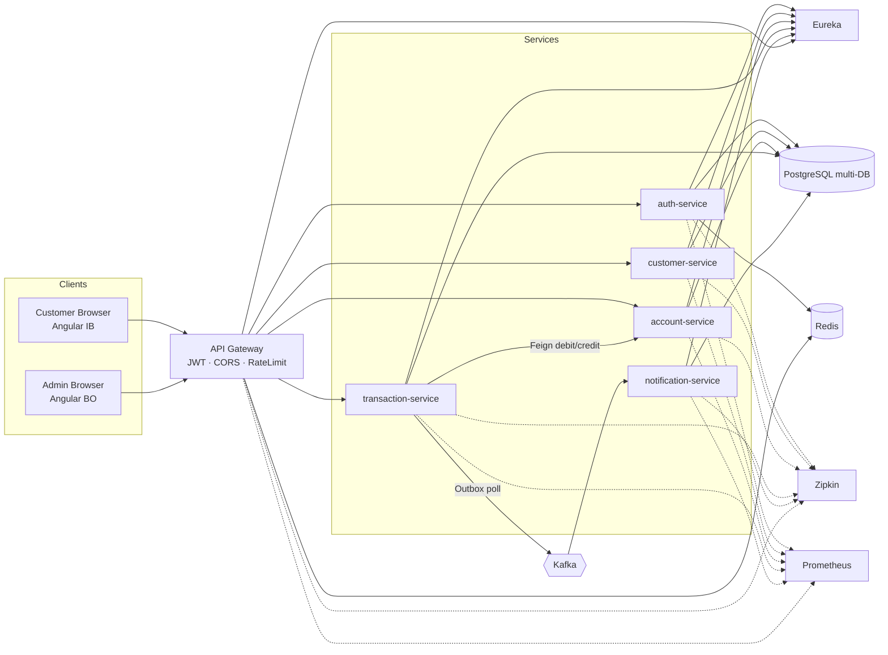
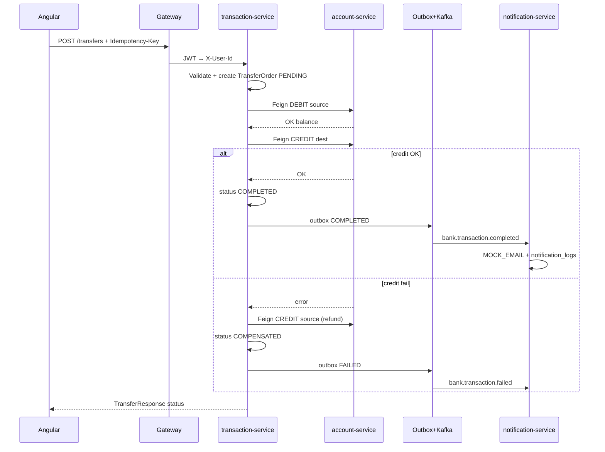
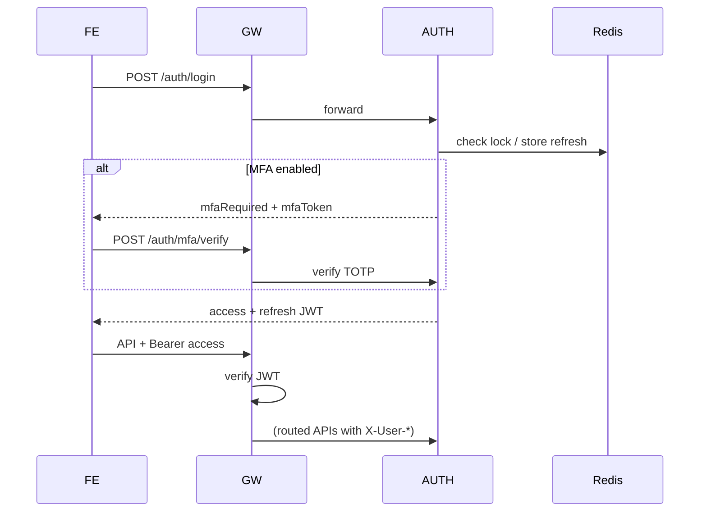

# Architecture diagrams (Mermaid)

Export PNG optional: paste vào [mermaid.live](https://mermaid.live) → Download PNG/SVG cho slide.

## 1. System context



## 2. Transfer saga (happy + compensate)



## 3. Auth / token flow



## 4. Portal split

```mermaid
flowchart TB
  subgraph IB["Internet Banking /customer"]
    H[Header + Footer]
    H --> Home & Accounts & Transfer & History & Profile
  end

  subgraph BO["Back Office /admin"]
    S[Left module nav]
    S --> Dash & Customers & Freeze & Tx & Audit & RBAC
  end

  LoginC[/auth/login] --> IB
  LoginA[/admin/login] --> BO
```
