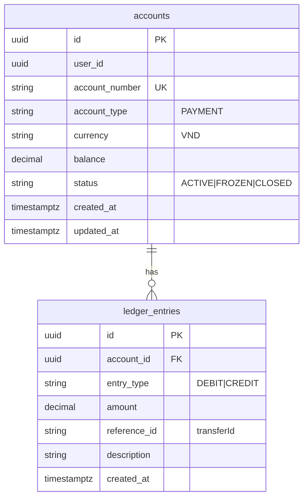

# ER — account-service (`bank_account`)



```sql
CREATE TABLE accounts (
  id UUID PRIMARY KEY,
  user_id UUID NOT NULL,
  account_number VARCHAR(20) NOT NULL UNIQUE,
  account_type VARCHAR(20) NOT NULL DEFAULT 'PAYMENT',
  currency VARCHAR(3) NOT NULL DEFAULT 'VND',
  balance NUMERIC(19,2) NOT NULL DEFAULT 0 CHECK (balance >= 0),
  status VARCHAR(20) NOT NULL DEFAULT 'ACTIVE',
  created_at TIMESTAMPTZ NOT NULL DEFAULT NOW(),
  updated_at TIMESTAMPTZ NOT NULL DEFAULT NOW()
);
CREATE INDEX idx_accounts_user ON accounts(user_id);

CREATE TABLE ledger_entries (
  id UUID PRIMARY KEY,
  account_id UUID NOT NULL REFERENCES accounts(id),
  entry_type VARCHAR(10) NOT NULL,
  amount NUMERIC(19,2) NOT NULL CHECK (amount > 0),
  reference_id VARCHAR(64),
  description VARCHAR(255),
  created_at TIMESTAMPTZ NOT NULL DEFAULT NOW()
);
CREATE INDEX idx_ledger_account ON ledger_entries(account_id);
CREATE INDEX idx_ledger_ref ON ledger_entries(reference_id);
```

## Debit SQL (atomic)

```sql
UPDATE accounts
SET balance = balance - :amount, updated_at = NOW()
WHERE id = :id AND status = 'ACTIVE' AND balance >= :amount;
```
