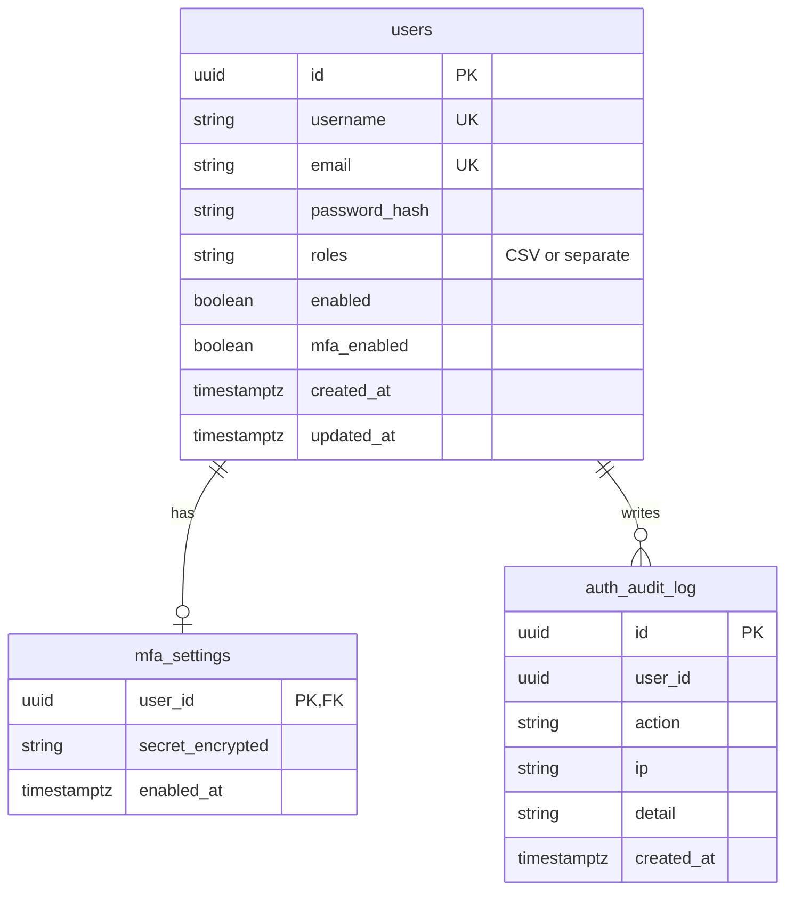

# ER — auth-service (`bank_auth`)

## Mermaid



## Flyway V1

```sql
CREATE TABLE users (
  id UUID PRIMARY KEY,
  username VARCHAR(50) NOT NULL UNIQUE,
  email VARCHAR(255) NOT NULL UNIQUE,
  password_hash VARCHAR(100) NOT NULL,
  roles VARCHAR(100) NOT NULL DEFAULT 'CUSTOMER',
  enabled BOOLEAN NOT NULL DEFAULT TRUE,
  mfa_enabled BOOLEAN NOT NULL DEFAULT FALSE,
  created_at TIMESTAMPTZ NOT NULL DEFAULT NOW(),
  updated_at TIMESTAMPTZ NOT NULL DEFAULT NOW()
);

CREATE TABLE mfa_settings (
  user_id UUID PRIMARY KEY REFERENCES users(id),
  secret_encrypted TEXT NOT NULL,
  enabled_at TIMESTAMPTZ NOT NULL DEFAULT NOW()
);

CREATE TABLE auth_audit_log (
  id UUID PRIMARY KEY,
  user_id UUID,
  action VARCHAR(50) NOT NULL,
  ip VARCHAR(64),
  detail TEXT,
  created_at TIMESTAMPTZ NOT NULL DEFAULT NOW()
);
```

## Notes

- Refresh tokens **không** lưu DB (Redis)
- roles: MVP string `"CUSTOMER"` / `"ADMIN"` / `"CUSTOMER,ADMIN"`
