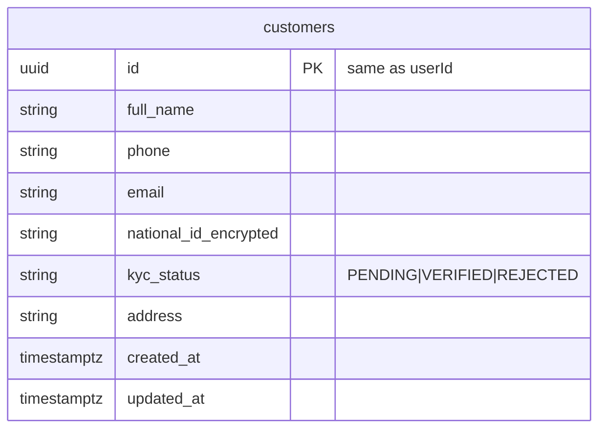

# ER — customer-service (`bank_customer`)



```sql
CREATE TABLE customers (
  id UUID PRIMARY KEY,
  full_name VARCHAR(200) NOT NULL,
  phone VARCHAR(20),
  email VARCHAR(255),
  national_id_encrypted TEXT,
  kyc_status VARCHAR(20) NOT NULL DEFAULT 'PENDING',
  address VARCHAR(500),
  created_at TIMESTAMPTZ NOT NULL DEFAULT NOW(),
  updated_at TIMESTAMPTZ NOT NULL DEFAULT NOW()
);
```

## API mask

- Response never returns raw nationalId; return `nationalIdMasked` e.g. `***********123`
- Update nationalId: encrypt before save
