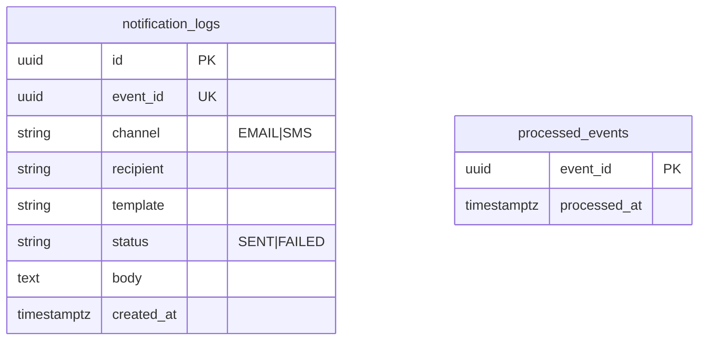

# ER — notification-service (`bank_notification`)



```sql
CREATE TABLE processed_events (
  event_id UUID PRIMARY KEY,
  processed_at TIMESTAMPTZ NOT NULL DEFAULT NOW()
);

CREATE TABLE notification_logs (
  id UUID PRIMARY KEY,
  event_id UUID NOT NULL UNIQUE,
  channel VARCHAR(10) NOT NULL,
  recipient VARCHAR(255) NOT NULL,
  template VARCHAR(50) NOT NULL,
  status VARCHAR(20) NOT NULL,
  body TEXT,
  created_at TIMESTAMPTZ NOT NULL DEFAULT NOW()
);
```

## Behavior

- On Kafka message: if `event_id` in processed_events → skip
- Else write log status SENT (mock), insert processed_events same TX
