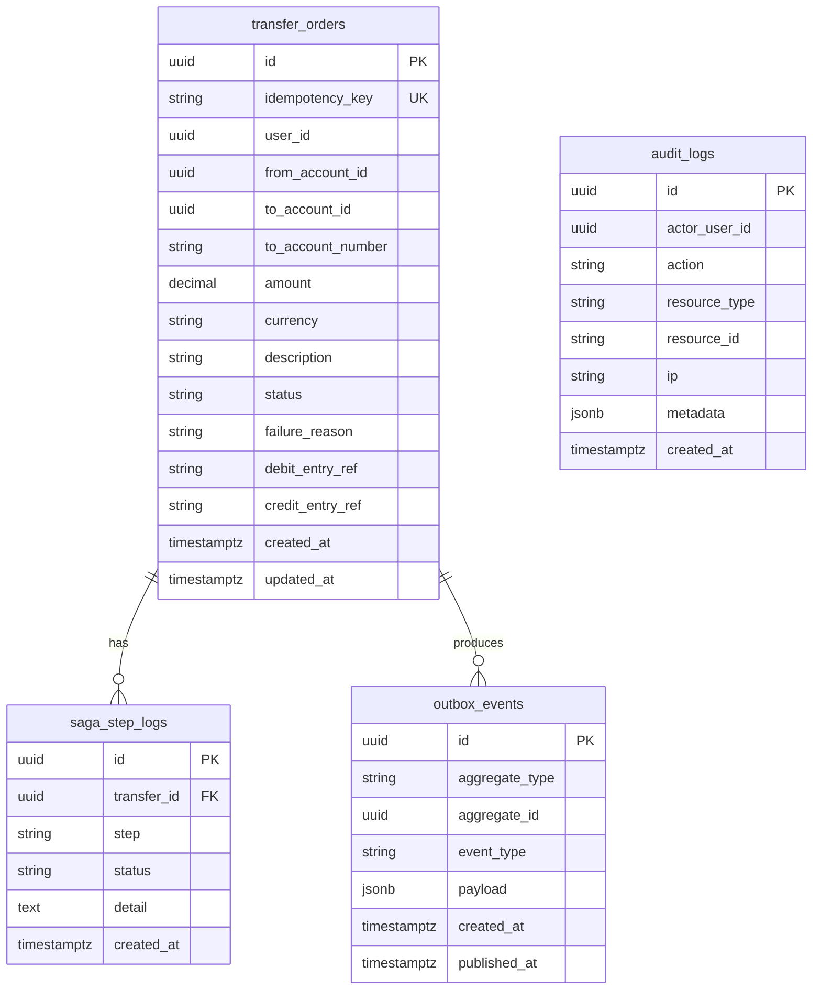

# ER — transaction-service (`bank_transaction`)

Full SQL: implement trong Flyway theo columns trên.  
Status values: `PENDING|DEBITED|COMPLETED|FAILED|COMPENSATING|COMPENSATED`  
See `docs/01-architecture/saga-transfer.md`.
